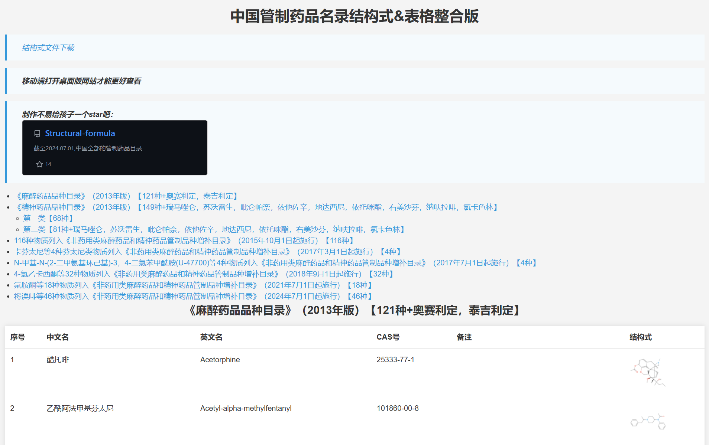

# [截至2025.07.01,中国全部的管制药品目录](https://benzyl-titanium.pages.dev/posts/drug/structural-formula)

## [中国管制药品名录结构式&表格整合版](https://biantai.pages.dev/Structural-formula)

## 目录

- [麻醉药品目录](麻醉药品目录/README.md)  
- [第一类精神药品目录](第一类精神药品目录/README.md)  
- [第二类精神药品目录](第二类精神药品目录/README.md)  
- [非药用类麻醉药品和精神药品管制品种增补目录](非药用类麻醉药品和精神药品管制品种增补目录/README.md)  

## 文件下载

- [我国管制毒品目录表格（2025年7月更新，521种+三大类）](https://github.com/Benzyl-titanium/Structural-formula/releases/download/2025.07.01/2025.07.01.xlsx)

- [截至2025.07.01中国管制药品结构式文件](https://github.com/Benzyl-titanium/Structural-formula/releases/download/2025.07.01/Structural-formula.zip)
