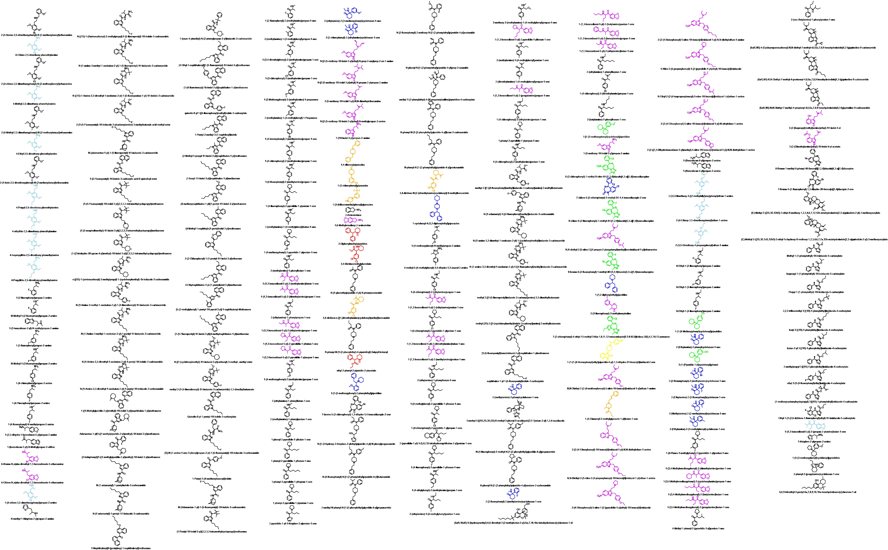

# 结构式

  

# 表格

## 116种物质列入《非药用类麻醉药品和精神药品管制品种增补目录》（2015年10月1日起施行）【116种】

<table border="1" cellpadding="1" cellspacing="1" style="width:100%;" width="677">
    <tbody>
        <tr>
            <td valign="center" width="57.33333333333333">
            
<strong>序号</strong>
</td>
            <td valign="center" width="87.33333333333333">
            
<strong>中文名</strong>
</td>
            <td valign="center" width="122.33333333333333">
            
<strong>英文名</strong>
</td>
            <td valign="center" width="79.33333333333333">
            
<strong>CAS号</strong>
</td>
            <td valign="center" width="69.33333333333333">
            
<strong>备注</strong>
</td>
        </tr>
        <tr>
            <td valign="center" width="57.33333333333333">
            
1
</td>
            <td valign="center" width="93.33333333333333">
            
N-(2-甲氧基苄基)-2-(2,5-二甲氧基-4-溴苯基)乙胺
</td>
            <td valign="center" width="128.33333333333334">
            
2-(4-Bromo-2,5-dimethoxyphenyl)-N-(2-methoxybenzyl)ethanamine
</td>
            <td valign="center" width="79.33333333333333">
            
1026511-90-9
</td>
            <td valign="center" width="69.33333333333333">
            
2C-B-NBOMe
</td>
        </tr>
        <tr>
            <td valign="center" width="65">
            
2
</td>
            <td valign="center" width="93.33333333333333">
            
2,5-二甲氧基-4-氯苯乙胺
</td>
            <td valign="center" width="128.33333333333334">
            
4-Chloro-2,5-dimethoxyphenethylamine
</td>
            <td valign="center" width="85.33333333333333">
            
88441-14-9
</td>
            <td valign="center" width="69.33333333333333">
            
2C-C
</td>
        </tr>
        <tr>
            <td valign="center" width="65">
            
3
</td>
            <td valign="center" width="93.33333333333333">
            
N-(2-甲氧基苄基)-2-(2,5-二甲氧基-4-氯苯基)乙胺
</td>
            <td valign="center" width="128.33333333333334">
            
2-(4-Chloro-2,5-dimethoxyphenyl)-N-(2-methoxybenzyl)ethanamine
</td>
            <td valign="center" width="85.33333333333333">
            
1227608-02-7
</td>
            <td valign="center" width="69.33333333333333">
            
2C-C-NBOMe
</td>
        </tr>
        <tr>
            <td valign="center" width="65">
            
4
</td>
            <td valign="center" width="93.33333333333333">
            
2,5-二甲氧基-4-甲基苯乙胺
</td>
            <td valign="center" width="128.33333333333334">
            
4-Methyl-2,5-dimethoxyphenethylamine
</td>
            <td valign="center" width="85.33333333333333">
            
24333-19-5
</td>
            <td valign="center" width="69.33333333333333">
            
2C-D
</td>
        </tr>
        <tr>
            <td valign="center" width="65">
            
5
</td>
            <td valign="center" width="93.33333333333333">
            
N-(2-甲氧基苄基)-2-(2,5-二甲氧基-4-甲基苯基)乙胺
</td>
            <td valign="center" width="128.33333333333334">
            
2-(4-Methyl-2,5-dimethoxyphenyl)-N-(2-methoxybenzyl)ethanamine
</td>
            <td valign="center" width="85.33333333333333">
            
1354632-02-2
</td>
            <td valign="center" width="69.33333333333333">
            
2C-D-NBOMe
</td>
        </tr>
        <tr>
            <td valign="center" width="65">
            
6
</td>
            <td valign="center" width="93.33333333333333">
            
2,5-二甲氧基-4-乙基苯乙胺
</td>
            <td valign="center" width="128.33333333333334">
            
4-Ethyl-2,5-dimethoxyphenethylamine
</td>
            <td valign="center" width="85.33333333333333">
            
71539-34-9
</td>
            <td valign="center" width="69.33333333333333">
            
2C-E
</td>
        </tr>
        <tr>
            <td valign="center" width="65">
            
7
</td>
            <td valign="center" width="93.33333333333333">
            
N-(2-甲氧基苄基)-2-(2,5-二甲氧基-4-碘苯基)乙胺
</td>
            <td valign="center" width="128.33333333333334">
            
2-(4-Iodo-2,5-dimethoxyphenyl)-N-(2-methoxybenzyl)ethanamine
</td>
            <td valign="center" width="85.33333333333333">
            
919797-19-6
</td>
            <td valign="center" width="69.33333333333333">
            
2C-I-NBOMe
</td>
        </tr>
        <tr>
            <td valign="center" width="65">
            
8
</td>
            <td valign="center" width="93.33333333333333">
            
2,5-二甲氧基-4-丙基苯乙胺
</td>
            <td valign="center" width="128.33333333333334">
            
4-Propyl-2,5-dimethoxyphenethylamine
</td>
            <td valign="center" width="85.33333333333333">
            
207740-22-5
</td>
            <td valign="center" width="69.33333333333333">
            
2C-P
</td>
        </tr>
        <tr>
            <td valign="center" width="65">
            
9
</td>
            <td valign="center" width="93.33333333333333">
            
2,5-二甲氧基-4-乙硫基苯乙胺
</td>
            <td valign="center" width="128.33333333333334">
            
4-Ethylthio-2,5-dimethoxyphenethylamine
</td>
            <td valign="center" width="85.33333333333333">
            
207740-24-7
</td>
            <td valign="center" width="69.33333333333333">
            
2C-T-2
</td>
        </tr>
        <tr>
            <td valign="center" width="65">
            
10
</td>
            <td valign="center" width="93.33333333333333">
            
2,5-二甲氧基-4-异丙基硫基苯乙胺
</td>
            <td valign="center" width="128.33333333333334">
            
4-Isopropylthio-2,5-dimethoxyphenethylamine
</td>
            <td valign="center" width="85.33333333333333">
            
207740-25-8
</td>
            <td valign="center" width="69.33333333333333">
            
2C-T-4
</td>
        </tr>
        <tr>
            <td valign="center" width="65">
            
11
</td>
            <td valign="center" width="93.33333333333333">
            
2,5-二甲氧基-4-丙硫基苯乙胺
</td>
            <td valign="center" width="128.33333333333334">
            
4-Propylthio-2,5-dimethox-phenethylamine
</td>
            <td valign="center" width="85.33333333333333">
            
207740-26-9
</td>
            <td valign="center" width="69.33333333333333">
            
2C-T-7
</td>
        </tr>
        <tr>
            <td valign="center" width="65">
            
12
</td>
            <td valign="center" width="93.33333333333333">
            
2-氟苯丙胺
</td>
            <td valign="center" width="128.33333333333334">
            
1-(2-Fluorophenyl)propan-2-amine
</td>
            <td valign="center" width="85.33333333333333">
            
1716-60-5
</td>
            <td valign="center" width="69.33333333333333">
            
2-FA
</td>
        </tr>
        <tr>
            <td valign="center" width="65">
            
13
</td>
            <td valign="center" width="93.33333333333333">
            
2-氟甲基苯丙胺
</td>
            <td valign="center" width="128.33333333333334">
            
N-Methyl-1-(2-fluorophenyl)propan-2-amine
</td>
            <td valign="center" width="85.33333333333333">
            
1017176-48-5
</td>
            <td valign="center" width="69.33333333333333">
            
2-FMA
</td>
        </tr>
        <tr>
            <td valign="center" width="65">
            
14
</td>
            <td valign="center" width="93.33333333333333">
            
1-(2-苯并呋喃基)-N-甲基-2-丙胺
</td>
            <td valign="center" width="128.33333333333334">
            
N-Methyl-1-(benzofuran-2-yl)propan-2-amine
</td>
            <td valign="center" width="85.33333333333333">
            
806596-15-6
</td>
            <td valign="center" width="69.33333333333333">
            
2-MAPB
</td>
        </tr>
        <tr>
            <td valign="center" width="65">
            
15
</td>
            <td valign="center" width="93.33333333333333">
            
3-氟苯丙胺
</td>
            <td valign="center" width="128.33333333333334">
            
1-(3-Fluorophenyl)propan-2-amine
</td>
            <td valign="center" width="85.33333333333333">
            
1626-71-7
</td>
            <td valign="center" width="69.33333333333333">
            
3-FA
</td>
        </tr>
        <tr>
            <td valign="center" width="65">
            
16
</td>
            <td valign="center" width="93.33333333333333">
            
3-氟甲基苯丙胺
</td>
            <td valign="center" width="128.33333333333334">
            
N-Methyl-1-(3-fluorophenyl)propan-2-amine
</td>
            <td valign="center" width="85.33333333333333">
            
1182818-14-9
</td>
            <td valign="center" width="69.33333333333333">
            
3-FMA
</td>
        </tr>
        <tr>
            <td valign="center" width="65">
            
17
</td>
            <td valign="center" width="93.33333333333333">
            
4-氯苯丙胺
</td>
            <td valign="center" width="128.33333333333334">
            
1-(4-Chlorophenyl)propan-2-amine
</td>
            <td valign="center" width="85.33333333333333">
            
64-12-0
</td>
            <td valign="center" width="69.33333333333333">
            
4-CA
</td>
        </tr>
        <tr>
            <td valign="center" width="65">
            
18
</td>
            <td valign="center" width="93.33333333333333">
            
4-氟苯丙胺
</td>
            <td valign="center" width="128.33333333333334">
            
1-(4-Fluorophenyl)propan-2-amine
</td>
            <td valign="center" width="85.33333333333333">
            
459-02-9
</td>
            <td valign="center" width="69.33333333333333">
            
4-FA
</td>
        </tr>
        <tr>
            <td valign="center" width="65">
            
19
</td>
            <td valign="center" width="93.33333333333333">
            
4-氟甲基苯丙胺
</td>
            <td valign="center" width="128.33333333333334">
            
N-Methyl-1-(4-fluorophenyl)propan-2-amine
</td>
            <td valign="center" width="85.33333333333333">
            
351-03-1
</td>
            <td valign="center" width="69.33333333333333">
            
4-FMA
</td>
        </tr>
        <tr>
            <td valign="center" width="65">
            
20
</td>
            <td valign="center" width="93.33333333333333">
            
1-[5-(2,3-二氢苯并呋喃基)]-2-丙胺
</td>
            <td valign="center" width="128.33333333333334">
            
1-(2,3-Dihydro-1-benzofuran-5-yl)propan-2-

            
amine
</td>
            <td valign="center" width="85.33333333333333">
            
152624-03-8
</td>
            <td valign="center" width="69.33333333333333">
            
5-APDB
</td>
        </tr>
        <tr>
            <td valign="center" width="65">
            
21
</td>
            <td valign="center" width="93.33333333333333">
            
1-(5-苯并呋喃基)-N-甲基-2-丙胺
</td>
            <td valign="center" width="128.33333333333334">
            
N-Methyl-1-(benzofuran-5-yl)propan-2-amine
</td>
            <td valign="center" width="85.33333333333333">
            
1354631-77-8
</td>
            <td valign="center" width="69.33333333333333">
            
5-MAPB
</td>
        </tr>
        <tr>
            <td valign="center" width="65">
            
22
</td>
            <td valign="center" width="93.33333333333333">
            
6-溴-3,4-亚甲二氧基甲基苯丙胺
</td>
            <td valign="center" width="128.33333333333334">
            
N-Methyl-(6-bromo-3,4-methylenedioxyphenyl)propan-2-amine
</td>
            <td valign="center" width="85.33333333333333"></td>
            <td valign="center" width="69.33333333333333">
            
6-Br-MDMA
</td>
        </tr>
        <tr>
            <td valign="center" width="65">
            
23
</td>
            <td valign="center" width="93.33333333333333">
            
6-氯-3,4-亚甲二氧基甲基苯丙胺
</td>
            <td valign="center" width="128.33333333333334">
            
N-Methyl-(6-chloro-3,4-methylenedioxyphenyl)propan-2-amine
</td>
            <td valign="center" width="85.33333333333333">
            
319920-71-3
</td>
            <td valign="center" width="69.33333333333333">
            
6-Cl-MDMA
</td>
        </tr>
        <tr>
            <td valign="center" width="65">
            
24
</td>
            <td valign="center" width="93.33333333333333">
            
1-(2,5-二甲氧基-4-氯苯基)-2-丙胺
</td>
            <td valign="center" width="128.33333333333334">
            
1-(4-Chloro-2,5-dimethoxyphenyl)propan-2-amine
</td>
            <td valign="center" width="85.33333333333333">
            
123431-31-2
</td>
            <td valign="center" width="69.33333333333333">
            
DOC
</td>
        </tr>
        <tr>
            <td valign="center" width="65">
            
25
</td>
            <td valign="center" width="93.33333333333333">
            
1-(2-噻吩基)-N-甲基-2-丙胺
</td>
            <td valign="center" width="128.33333333333334">
            
N-Methyl-1-(thiophen-2-yl)propan-2-amine
</td>
            <td valign="center" width="85.33333333333333">
            
801156-47-8
</td>
            <td valign="center" width="69.33333333333333">
            
MPA
</td>
        </tr>
        <tr>
            <td valign="center" width="65">
            
26
</td>
            <td valign="center" width="93.33333333333333">
            
N-(1-氨甲酰基-2-甲基丙基)-1-(5-氟戊基)吲哚-3-甲酰胺
</td>
            <td valign="center" width="128.33333333333334">
            
N-(1-Amino-3-methyl-1-oxobutan-2-yl)-1-(5-fluoropentyl)-1H-indole-3-carboxamide
</td>
            <td valign="center" width="85.33333333333333">
            
1801338-26-0
</td>
            <td valign="center" width="69.33333333333333">
            
5F-ABICA
</td>
        </tr>
        <tr>
            <td valign="center" width="65">
            
27
</td>
            <td valign="center" width="93.33333333333333">
            
N-(1-氨甲酰基-2-甲基丙基)-1-(5-氟戊基)吲唑-3-甲酰胺
</td>
            <td valign="center" width="128.33333333333334">
            
N-(1-Amino-3-methyl-1-oxobutan-2-yl)-1-(5-fluoropentyl)-1H-indazole-3-carboxamide
</td>
            <td valign="center" width="85.33333333333333">
            
1800101-60-3
</td>
            <td valign="center" width="69.33333333333333">
            
5F-AB-PINACA
</td>
        </tr>
        <tr>
            <td valign="center" width="65">
            
28
</td>
            <td valign="center" width="93.33333333333333">
            
N-(1-氨甲酰基-2,2-二甲基丙基)-1-(5-氟戊基)吲哚-3-甲酰胺
</td>
            <td valign="center" width="128.33333333333334">
            
N-(1-Amino-3,3-dimethyl-1-oxobutan-2-yl)-1-(5-fluoropentyl)-1H-indole-3-carboxamide
</td>
            <td valign="center" width="85.33333333333333">
            
1801338-27-1
</td>
            <td valign="center" width="69.33333333333333">
            
5F-ADBICA
</td>
        </tr>
        <tr>
            <td valign="center" width="65">
            
29
</td>
            <td valign="center" width="93.33333333333333">
            
N-(1-甲氧基羰基-2-甲基丙基)-1-(5-氟戊基)吲唑-3-甲酰胺
</td>
            <td valign="center" width="128.33333333333334">
            
1-Methoxy-3-methyl-1-oxobutan-2-yl-1-(5-

            
fluoropentyl)-1H-indazole-3-carboxamide
</td>
            <td valign="center" width="85.33333333333333">
            
1715016-74-2
</td>
            <td valign="center" width="69.33333333333333">
            
5F-AMB
</td>
        </tr>
        <tr>
            <td valign="center" width="65">
            
30
</td>
            <td valign="center" width="93.33333333333333">
            
N-(1-金刚烷基)-1-(5-氟戊基)吲唑-3-甲酰胺
</td>
            <td valign="center" width="128.33333333333334">
            
N-(1-Adamantyl)-1-(5-fluoropentyl)-1H-indazole-3-carboxamide
</td>
            <td valign="center" width="85.33333333333333">
            
1400742-13-3
</td>
            <td valign="center" width="69.33333333333333">
            
5F-APINACA
</td>
        </tr>
        <tr>
            <td valign="center" width="65">
            
31
</td>
            <td valign="center" width="93.33333333333333">
            
1-(5-氟戊基)吲哚-3-甲酸-8-喹啉酯
</td>
            <td valign="center" width="128.33333333333334">
            
Quinolin-8-yl 1-(5-fluoropentyl)-1H-indole-3-carboxylate
</td>
            <td valign="center" width="85.33333333333333">
            
1400742-41-7
</td>
            <td valign="center" width="69.33333333333333">
            
5F-PB-22
</td>
        </tr>
        <tr>
            <td valign="center" width="65">
            
32
</td>
            <td valign="center" width="93.33333333333333">
            
1-(5-氟戊基)-3-(2,2,3,3-四甲基环丙甲酰基)吲哚
</td>
            <td valign="center" width="128.33333333333334">
            
(1-(5-Fluoropentyl)-1H-indol-3-yl)(2,2,3,3-tetramethylcyclopropyl)methanone
</td>
            <td valign="center" width="85.33333333333333">
            
1364933-54-9
</td>
            <td valign="center" width="69.33333333333333">
            
5F-UR-144
</td>
        </tr>
        <tr>
            <td valign="center" width="65">
            
33
</td>
            <td valign="center" width="93.33333333333333">
            
1-[2-(N-吗啉基)乙基]-3-(2,2,3,3-四甲基环丙甲酰基)吲哚
</td>
            <td valign="center" width="128.33333333333334">
            
(1-(2-Morpholin-4-ylethyl)-1H-indol-3-yl)(2,2,3,3-tetramethylcyclopropyl)methanone
</td>
            <td valign="center" width="85.33333333333333">
            
895155-26-7
</td>
            <td valign="center" width="69.33333333333333">
            
A-796,260
</td>
        </tr>
        <tr>
            <td valign="center" width="65">
            
34
</td>
            <td valign="center" width="93.33333333333333">
            
1-(4-四氢吡喃基甲基)-3-(2,2,3,3-四甲基环丙甲酰基)吲哚
</td>
            <td valign="center" width="128.33333333333334">
            
(1-(Tetrahydropyran-4-ylmethyl)-1H-indol-3-yl)(2,2,3,3-tetramethylcyclopropyl)methanone
</td>
            <td valign="center" width="85.33333333333333">
            
895155-57-4
</td>
            <td valign="center" width="69.33333333333333">
            
A-834,735
</td>
        </tr>
        <tr>
            <td valign="center" width="65">
            
35
</td>
            <td valign="center" width="93.33333333333333">
            
N-(1-氨甲酰基-2-甲基丙基)-1-(环己基甲基)吲唑-3-甲酰胺
</td>
            <td valign="center" width="128.33333333333334">
            
N-(1-Amino-3-methyl-1-oxobutan-2-yl)-1-(cyclohexylmethyl)-1H-indazole-3-carboxamide
</td>
            <td valign="center" width="85.33333333333333">
            
1185887-21-1
</td>
            <td valign="center" width="69.33333333333333">
            
AB-CHMINACA
</td>
        </tr>
        <tr>
            <td valign="center" width="65">
            
36
</td>
            <td valign="center" width="93.33333333333333">
            
N-(1-氨甲酰基-2-甲基丙基)-1-(4-氟苄基)吲唑-3-甲酰胺
</td>
            <td valign="center" width="128.33333333333334">
            
N-(1-Amino-3-methyl-1-oxobutan-2-yl)-1-(4-fluorobenzyl)-1H-indazole-3-carboxamide
</td>
            <td valign="center" width="85.33333333333333">
            
1629062-56-1
</td>
            <td valign="center" width="69.33333333333333">
            
AB-FUBINACA
</td>
        </tr>
        <tr>
            <td valign="center" width="65">
            
37
</td>
            <td valign="center" width="93.33333333333333">
            
N-(1-氨甲酰基-2-甲基丙基)-1-戊基吲唑-3-甲酰胺
</td>
            <td valign="center" width="128.33333333333334">
            
N-(1-Amino-3-methyl-1-oxobutan-2-yl)-1-pe-ntyl-1H-indazole-3-carboxamide
</td>
            <td valign="center" width="85.33333333333333">
            
1445583-20-9
</td>
            <td valign="center" width="69.33333333333333">
            
AB-PINACA
</td>
        </tr>
        <tr>
            <td valign="center" width="65">
            
38
</td>
            <td valign="center" width="93.33333333333333">
            
N-(1-氨甲酰基-2,2-二甲基丙基)-1-戊基吲哚-3-甲酰胺
</td>
            <td valign="center" width="128.33333333333334">
            
N-(1-Amino-3,3-dimethyl-1-oxobutan-2-yl)-1-pentyl-1H-indole-3-carboxamide
</td>
            <td valign="center" width="85.33333333333333">
            
1445583-48-1
</td>
            <td valign="center" width="69.33333333333333">
            
ADBICA
</td>
        </tr>
        <tr>
            <td valign="center" width="65">
            
39
</td>
            <td valign="center" width="93.33333333333333">
            
N-(1-氨甲酰基-2,2-二甲基丙基)-1-戊基吲唑-3-甲酰胺
</td>
            <td valign="center" width="128.33333333333334">
            
N-(1-Amino-3,3-dimethyl-1-oxobutan-2-yl)-1-pentyl-1H-indazole-3-carboxamide
</td>
            <td valign="center" width="85.33333333333333">
            
1633766-73-0
</td>
            <td valign="center" width="69.33333333333333">
            
ADB-PINACA
</td>
        </tr>
        <tr>
            <td valign="center" width="65">
            
40
</td>
            <td valign="center" width="93.33333333333333">
            
1-[(N-甲基-2-哌啶基)甲基]-3-(1-萘甲酰基)吲哚
</td>
            <td valign="center" width="128.33333333333334">
            
(1-((1-Methylpiperidin-2-yl)methyl)-1H-indol-3-yl)(naphthalen-1-yl)methanone
</td>
            <td valign="center" width="85.33333333333333">
            
137642-54-7
</td>
            <td valign="center" width="69.33333333333333">
            
AM-1220
</td>
        </tr>
        <tr>
            <td valign="center" width="65">
            
41
</td>
            <td valign="center" width="93.33333333333333">
            
1-[(N-甲基-2-哌啶基)甲基]-3-(1-金刚烷基甲酰基)吲哚
</td>
            <td valign="center" width="128.33333333333334">
            
(1-((1-Methylpiperidin-2-yl)methyl)-1H-indol-3-yl)(adamantan-1-yl)methanone
</td>
            <td valign="center" width="85.33333333333333">
            
335160-66-2
</td>
            <td valign="center" width="69.33333333333333">
            
AM-1248
</td>
        </tr>
        <tr>
            <td valign="center" width="65">
            
42
</td>
            <td valign="center" width="93.33333333333333">
            
1-[(N-甲基-2-哌啶基)甲基]-3-(2-碘苯甲酰基)吲哚
</td>
            <td valign="center" width="128.33333333333334">
            
(1-((1-Methylpiperidin-2-yl)methyl)-1H-indol-3-yl)(2-iodophenyl)methanone
</td>
            <td valign="center" width="85.33333333333333">
            
444912-75-8
</td>
            <td valign="center" width="69.33333333333333">
            
AM-2233
</td>
        </tr>
        <tr>
            <td valign="center" width="65">
            
43
</td>
            <td valign="center" width="93.33333333333333">
            
N-(1-金刚烷基)-1-戊基吲哚-3-甲酰胺
</td>
            <td valign="center" width="128.33333333333334">
            
N-(1-Adamantyl)-1-pentyl-1H-indole-3-carboxamide
</td>
            <td valign="center" width="85.33333333333333">
            
1345973-50-3 
</td>
            <td valign="center" width="69.33333333333333">
            
APICA
</td>
        </tr>
        <tr>
            <td valign="center" width="65">
            
44
</td>
            <td valign="center" width="93.33333333333333">
            
N-(1-金刚烷基)-1-戊基吲唑-3-甲酰胺
</td>
            <td valign="center" width="128.33333333333334">
            
N-(1-Adamantyl)-1-pentyl-1H-indazole-3-carboxamide
</td>
            <td valign="center" width="85.33333333333333">
            
1345973-53-6
</td>
            <td valign="center" width="69.33333333333333">
            
APINACA
</td>
        </tr>
        <tr>
            <td valign="center" width="65">
            
45
</td>
            <td valign="center" width="93.33333333333333">
            
1-(1-萘甲酰基)-4-戊氧基萘
</td>
            <td valign="center" width="128.33333333333334">
            
(4-Pentyloxynaphthalen-1-yl)(naphthalen-1-yl)methanone
</td>
            <td valign="center" width="85.33333333333333">
            
432047-72-8
</td>
            <td valign="center" width="69.33333333333333">
            
CB-13
</td>
        </tr>
        <tr>
            <td valign="center" width="65">
            
46
</td>
            <td valign="center" width="93.33333333333333">
            
N-(1-甲基-1-苯基乙基)-1-(4-四氢吡喃基甲基)吲唑-3-甲酰胺
</td>
            <td valign="center" width="128.33333333333334">
            
N-(2-Phenylpropan-2-yl)-1-(tetrahydropyran-4-ylmethyl)-1H-indazole-3-carboxamide
</td>
            <td valign="center" width="85.33333333333333">
            
1400742-50-8
</td>
            <td valign="center" width="69.33333333333333">
            
CUMYL-THPINACA
</td>
        </tr>
        <tr>
            <td valign="center" width="65">
            
47
</td>
            <td valign="center" width="93.33333333333333">
            
1-(5-氟戊基)-3-(4-乙基-1-萘甲酰基)吲哚
</td>
            <td valign="center" width="128.33333333333334">
            
(1-(5-Fluoropentyl)-1H-indol-3-yl)(4-ethylnaphthalen-1-yl)methanone
</td>
            <td valign="center" width="85.33333333333333">
            
1364933-60-7
</td>
            <td valign="center" width="69.33333333333333">
            
EAM-2201
</td>
        </tr>
        <tr>
            <td valign="center" width="65">
            
48
</td>
            <td valign="center" width="93.33333333333333">
            
1-(4-氟苄基)-3-(1-萘甲酰基)吲哚
</td>
            <td valign="center" width="128.33333333333334">
            
(1-(4-Fluorobenzyl)-1H-indol-3-yl)(naphthalen-1-yl)methanone
</td>
            <td valign="center" width="85.33333333333333"></td>
            <td valign="center" width="69.33333333333333">
            
FUB-JWH-018
</td>
        </tr>
        <tr>
            <td valign="center" width="65">
            
49
</td>
            <td valign="center" width="93.33333333333333">
            
1-(4-氟苄基)吲哚-3-甲酸-8-喹啉酯
</td>
            <td valign="center" width="128.33333333333334">
            
Quinolin-8-yl 1-(4-fluorobenzyl)-1H-indole-3-carboxylate
</td>
            <td valign="center" width="85.33333333333333">
            
1800098-36-5
</td>
            <td valign="center" width="69.33333333333333">
            
FUB-PB-22
</td>
        </tr>
        <tr>
            <td valign="center" width="65">
            
50
</td>
            <td valign="center" width="93.33333333333333">
            
2-甲基-1-戊基-3-(1-萘甲酰基)吲哚
</td>
            <td valign="center" width="128.33333333333334">
            
(2-Methyl-1-pentyl-1H-indol-3-yl)(naphthalen-1-yl)methanone
</td>
            <td valign="center" width="85.33333333333333">
            
155471-10-6
</td>
            <td valign="center" width="69.33333333333333">
            
JWH-007
</td>
        </tr>
        <tr>
            <td valign="center" width="65">
            
51
</td>
            <td valign="center" width="93.33333333333333">
            
2-甲基-1-丙基-3-(1-萘甲酰基)吲哚
</td>
            <td valign="center" width="128.33333333333334">
            
(2-Methyl-1-propyl-1H-indol-3-yl)(naphthalen-1-yl)methanone
</td>
            <td valign="center" width="85.33333333333333">
            
155471-08-2
</td>
            <td valign="center" width="69.33333333333333">
            
JWH-015
</td>
        </tr>
        <tr>
            <td valign="center" width="65">
            
52
</td>
            <td valign="center" width="93.33333333333333">
            
1-己基-3-(1-萘甲酰基)吲哚
</td>
            <td valign="center" width="128.33333333333334">
            
(1-Hexyl-1H-indol-3-yl)(naphthalen-1-yl)methanone
</td>
            <td valign="center" width="85.33333333333333">
            
209414-08-4
</td>
            <td valign="center" width="69.33333333333333">
            
JWH-019
</td>
        </tr>
        <tr>
            <td valign="center" width="65">
            
53
</td>
            <td valign="center" width="93.33333333333333">
            
1-戊基-3-(4-甲氧基-1-萘甲酰基)吲哚
</td>
            <td valign="center" width="128.33333333333334">
            
(1-Pentyl-1H-indol-3-yl)(4-methoxynaphthalen-1-yl)methanone
</td>
            <td valign="center" width="85.33333333333333">
            
210179-46-7
</td>
            <td valign="center" width="69.33333333333333">
            
JWH-081
</td>
        </tr>
        <tr>
            <td valign="center" width="65">
            
54
</td>
            <td valign="center" width="93.33333333333333">
            
1-戊基-3-(4-甲基-1-萘甲酰基)吲哚
</td>
            <td valign="center" width="128.33333333333334">
            
(1-Pentyl-1H-indol-3-yl)(4-methylnaphthalen-1-yl)methanone
</td>
            <td valign="center" width="85.33333333333333">
            
619294-47-2
</td>
            <td valign="center" width="69.33333333333333">
            
JWH-122
</td>
        </tr>
        <tr>
            <td valign="center" width="65">
            
55
</td>
            <td valign="center" width="93.33333333333333">
            
1-戊基-3-(2-氯苯乙酰基)吲哚
</td>
            <td valign="center" width="128.33333333333334">
            
2-(2-Chlorophenyl)-1-(1-pentyl-1H-indol-3-

            
yl)ethanone
</td>
            <td valign="center" width="85.33333333333333">
            
864445-54-5
</td>
            <td valign="center" width="69.33333333333333">
            
JWH-203
</td>
        </tr>
        <tr>
            <td valign="center" width="65">
            
56
</td>
            <td valign="center" width="93.33333333333333">
            
1-戊基-3-(4-乙基-1-萘甲酰基)吲哚
</td>
            <td valign="center" width="128.33333333333334">
            
(1-Pentyl-1H-indol-3-yl)(4-ethylnaphthalen-1-yl)methanone
</td>
            <td valign="center" width="85.33333333333333">
            
824959-81-1
</td>
            <td valign="center" width="69.33333333333333">
            
JWH-210
</td>
        </tr>
        <tr>
            <td valign="center" width="65">
            
57
</td>
            <td valign="center" width="93.33333333333333">
            
1-戊基-2-(2-甲基苯基)-4-(1-萘甲酰基)吡咯
</td>
            <td valign="center" width="128.33333333333334">
            
(5-(2-Methylphenyl)-1-pentyl-1H-pyrrol-3-yl)(naphthalen-1-yl)methanone
</td>
            <td valign="center" width="85.33333333333333">
            
914458-22-3
</td>
            <td valign="center" width="69.33333333333333">
            
JWH-370
</td>
        </tr>
        <tr>
            <td valign="center" width="65">
            
58
</td>
            <td valign="center" width="93.33333333333333">
            
1-(5-氟戊基)-3-(4-甲基-1-萘甲酰基)吲哚
</td>
            <td valign="center" width="128.33333333333334">
            
(1-(5-Fluoropentyl)-1H-indol-3-yl)(4-methylnaphthalen-1-yl)methanone
</td>
            <td valign="center" width="85.33333333333333">
            
1354631-24-5
</td>
            <td valign="center" width="69.33333333333333">
            
MAM-2201
</td>
        </tr>
        <tr>
            <td valign="center" width="65">
            
59
</td>
            <td valign="center" width="93.33333333333333">
            
N-(1-甲氧基羰基-2,2-二甲基丙基)-1-(环己基甲基)吲哚-3-甲酰胺
</td>
            <td valign="center" width="128.33333333333334">
            
N-(1-Methoxy-3,3-dimethyl-1-oxobutan-2-yl)-1-(cyclohexylmethyl)-1H-indole-3-carboxamide
</td>
            <td valign="center" width="85.33333333333333">
            
1715016-78-6
</td>
            <td valign="center" width="69.33333333333333">
            
MDMB-CHMICA
</td>
        </tr>
        <tr>
            <td valign="center" width="65">
            
60
</td>
            <td valign="center" width="93.33333333333333">
            
N-(1-甲氧基羰基-2,2-二甲基丙基)-1-(4-氟苄基)吲唑-3-甲酰胺
</td>
            <td valign="center" width="128.33333333333334">
            
N-(1-Methoxy-3,3-dimethyl-1-oxobutan-2-yl)-1-(4-fluorobenzyl)-1H-indazole-3-carboxamide
</td>
            <td valign="center" width="85.33333333333333">
            
1715016-77-5
</td>
            <td valign="center" width="69.33333333333333">
            
MDMB-FUBINACA
</td>
        </tr>
        <tr>
            <td valign="center" width="65">
            
61
</td>
            <td valign="center" width="93.33333333333333">
            
1-戊基吲哚-3-甲酸-8-喹啉酯
</td>
            <td valign="center" width="128.33333333333334">
            
Quinolin-8-yl 1-pentyl-1H-indole-3-carboxylate
</td>
            <td valign="center" width="85.33333333333333">
            
1400742-17-7
</td>
            <td valign="center" width="69.33333333333333">
            
PB-22
</td>
        </tr>
        <tr>
            <td valign="center" width="65">
            
62
</td>
            <td valign="center" width="93.33333333333333">
            
N-(1-氨甲酰基-2-苯基乙基)-1-(5-氟戊基)吲唑-3-甲酰胺
</td>
            <td valign="center" width="128.33333333333334">
            
N-(1-Amino-1-oxo-3-phenylpropan-2-yl)-1-

            
(5-fluoropentyl)-1H-indazole-3-carboxamide
</td>
            <td valign="center" width="85.33333333333333"></td>
            <td valign="center" width="69.33333333333333">
            
PX-2
</td>
        </tr>
        <tr>
            <td valign="center" width="65">
            
63
</td>
            <td valign="center" width="93.33333333333333">
            
1-戊基-3-(4-甲氧基苯甲酰基)吲哚
</td>
            <td valign="center" width="128.33333333333334">
            
(1-Pentyl-1H-indol-3-yl)(4-methoxyphenyl)methanone
</td>
            <td valign="center" width="85.33333333333333">
            
1345966-78-0
</td>
            <td valign="center" width="69.33333333333333">
            
RCS-4
</td>
        </tr>
        <tr>
            <td valign="center" width="65">
            
64
</td>
            <td valign="center" width="93.33333333333333">
            
N-(1-金刚烷基)-1-(5-氟戊基)吲哚-3-甲酰胺
</td>
            <td valign="center" width="128.33333333333334">
            
N-(1-Adamantyl)-1-(5-fluoropentyl)-1H-indole-3-carboxamide
</td>
            <td valign="center" width="85.33333333333333">
            
1354631-26-7
</td>
            <td valign="center" width="69.33333333333333">
            
STS-135
</td>
        </tr>
        <tr>
            <td valign="center" width="65">
            
65
</td>
            <td valign="center" width="93.33333333333333">
            
1-戊基-3-(2,2,3,3-四甲基环丙甲酰基)吲哚
</td>
            <td valign="center" width="128.33333333333334">
            
(1-Pentyl-1H-indol-3-yl)(2,2,3,3-tetramethylcyclopropyl)methanone
</td>
            <td valign="center" width="85.33333333333333">
            
1199943-44-6
</td>
            <td valign="center" width="69.33333333333333">
            
UR-144
</td>
        </tr>
        <tr>
            <td valign="center" width="65">
            
66
</td>
            <td valign="center" width="93.33333333333333">
            
2-氟甲卡西酮
</td>
            <td valign="center" width="128.33333333333334">
            
1-(2-Fluorophenyl)-2-methylaminopropan-1-one
</td>
            <td valign="center" width="85.33333333333333">
            
1186137-35-8
</td>
            <td valign="center" width="69.33333333333333">
            
2-FMC
</td>
        </tr>
        <tr>
            <td valign="center" width="65">
            
67
</td>
            <td valign="center" width="93.33333333333333">
            
2-甲基甲卡西酮
</td>
            <td valign="center" width="128.33333333333334">
            
1-(2-Methylphenyl)-2-methylaminopropan-1-one
</td>
            <td valign="center" width="85.33333333333333">
            
1246911-71-6
</td>
            <td valign="center" width="69.33333333333333">
            
2-MMC
</td>
        </tr>
        <tr>
            <td valign="center" width="65">
            
68
</td>
            <td valign="center" width="93.33333333333333">
            
3,4-二甲基甲卡西酮
</td>
            <td valign="center" width="128.33333333333334">
            
1-(3,4-Dimethylphenyl)-2-methylaminopropan-1-one
</td>
            <td valign="center" width="85.33333333333333">
            
1082110-00-6
</td>
            <td valign="center" width="69.33333333333333">
            
3,4-DMMC
</td>
        </tr>
        <tr>
            <td valign="center" width="65">
            
69
</td>
            <td valign="center" width="93.33333333333333">
            
3-氯甲卡西酮
</td>
            <td valign="center" width="128.33333333333334">
            
1-(3-Chlorophenyl)-2-methylaminopropan-1-one
</td>
            <td valign="center" width="85.33333333333333">
            
1049677-59-9
</td>
            <td valign="center" width="69.33333333333333">
            
3-CMC
</td>
        </tr>
        <tr>
            <td valign="center" width="65">
            
70
</td>
            <td valign="center" width="93.33333333333333">
            
3-甲氧基甲卡西酮
</td>
            <td valign="center" width="128.33333333333334">
            
1-(3-Methoxyphenyl)-2-methylaminopropan-1-one
</td>
            <td valign="center" width="85.33333333333333">
            
882302-56-9
</td>
            <td valign="center" width="69.33333333333333">
            
3-MeOMC
</td>
        </tr>
        <tr>
            <td valign="center" width="65">
            
71
</td>
            <td valign="center" width="93.33333333333333">
            
3-甲基甲卡西酮
</td>
            <td valign="center" width="128.33333333333334">
            
1-(3-Methylphenyl)-2-methylaminopropan-1-one
</td>
            <td valign="center" width="85.33333333333333">
            
1246911-86-3
</td>
            <td valign="center" width="69.33333333333333">
            
3-MMC
</td>
        </tr>
        <tr>
            <td valign="center" width="65">
            
72
</td>
            <td valign="center" width="93.33333333333333">
            
4-溴甲卡西酮
</td>
            <td valign="center" width="128.33333333333334">
            
1-(4-Bromophenyl)-2-methylaminopropan-1-one
</td>
            <td valign="center" width="85.33333333333333">
            
486459-03-4
</td>
            <td valign="center" width="69.33333333333333">
            
4-BMC
</td>
        </tr>
        <tr>
            <td valign="center" width="65">
            
73
</td>
            <td valign="center" width="93.33333333333333">
            
4-氯甲卡西酮
</td>
            <td valign="center" width="128.33333333333334">
            
1-(4-Chlorophenyl)-2-methylaminopropan-1-one
</td>
            <td valign="center" width="85.33333333333333">
            
1225843-86-6 
</td>
            <td valign="center" width="69.33333333333333">
            
4-CMC
</td>
        </tr>
        <tr>
            <td valign="center" width="65">
            
74
</td>
            <td valign="center" width="93.33333333333333">
            
4-氟甲卡西酮
</td>
            <td valign="center" width="128.33333333333334">
            
1-(4-Fluorophenyl)-2-methylaminopropan-1-one
</td>
            <td valign="center" width="85.33333333333333">
            
447-40-5
</td>
            <td valign="center" width="69.33333333333333">
            
4-FMC
</td>
        </tr>
        <tr>
            <td valign="center" width="65">
            
75
</td>
            <td valign="center" width="93.33333333333333">
            
1-(4-氟苯基)-2-(N-吡咯烷基)-1-戊酮
</td>
            <td valign="center" width="128.33333333333334">
            
1-(4-Fluorophenyl)-2-(1-pyrrolidinyl)pentan-1-one
</td>
            <td valign="center" width="85.33333333333333">
            
850352-62-4
</td>
            <td valign="center" width="69.33333333333333">
            
4-F-α-PVP
</td>
        </tr>
        <tr>
            <td valign="center" width="65">
            
76
</td>
            <td valign="center" width="93.33333333333333">
            
1-(4-甲基苯基)-2-甲氨基-1-丁酮
</td>
            <td valign="center" width="128.33333333333334">
            
1-(4-Methylphenyl)-2-methylaminobutan-1-one
</td>
            <td valign="center" width="85.33333333333333">
            
1337016-51-9
</td>
            <td valign="center" width="69.33333333333333">
            
4-MeBP
</td>
        </tr>
        <tr>
            <td valign="center" width="65">
            
77
</td>
            <td valign="center" width="93.33333333333333">
            
1-(4-甲氧基苯基)-2-(N-吡咯烷基)-1-戊酮
</td>
            <td valign="center" width="128.33333333333334">
            
1-(4-Methoxyphenyl)-2-(1-pyrrolidinyl)pentan-1-one
</td>
            <td valign="center" width="85.33333333333333">
            
14979-97-6
</td>
            <td valign="center" width="69.33333333333333">
            
4-MeO-α-PVP
</td>
        </tr>
        <tr>
            <td valign="center" width="65">
            
78
</td>
            <td valign="center" width="93.33333333333333">
            
1-苯基-2-甲氨基-1-丁酮
</td>
            <td valign="center" width="128.33333333333334">
            
1-Phenyl-2-methylaminobutan-1-one
</td>
            <td valign="center" width="85.33333333333333">
            
408332-79-6
</td>
            <td valign="center" width="69.33333333333333">
            
Buphedrone
</td>
        </tr>
        <tr>
            <td valign="center" width="65">
            
79
</td>
            <td valign="center" width="93.33333333333333">
            
2-甲氨基-1-[3,4-(亚甲二氧基)苯基]-1-丁酮
</td>
            <td valign="center" width="128.33333333333334">
            
1-(3,4-Methylenedioxyphenyl)-2-methylaminobutan-1-one
</td>
            <td valign="center" width="85.33333333333333">
            
802575-11-7
</td>
            <td valign="center" width="69.33333333333333">
            
Butylone
</td>
        </tr>
        <tr>
            <td valign="center" width="65">
            
80
</td>
            <td valign="center" width="93.33333333333333">
            
2-二甲氨基-1-[3,4-(亚甲二氧基)苯基]-1-丙酮
</td>
            <td valign="center" width="128.33333333333334">
            
1-(3,4-Methylenedioxyphenyl)-2-dimethylaminopropan-1-one
</td>
            <td valign="center" width="85.33333333333333">
            
765231-58-1
</td>
            <td valign="center" width="69.33333333333333">
            
Dimethylone
</td>
        </tr>
        <tr>
            <td valign="center" width="65">
            
81
</td>
            <td valign="center" width="93.33333333333333">
            
乙卡西酮
</td>
            <td valign="center" width="128.33333333333334">
            
1-Phenyl-2-ethylaminopropan-1-one
</td>
            <td valign="center" width="85.33333333333333">
            
18259-37-5
</td>
            <td valign="center" width="69.33333333333333">
            
Ethcathinone
</td>
        </tr>
        <tr>
            <td valign="center" width="65">
            
82
</td>
            <td valign="center" width="93.33333333333333">
            
3,4-亚甲二氧基乙卡西酮
</td>
            <td valign="center" width="128.33333333333334">
            
1-(3,4-Methylenedioxyphenyl)-2-ethylaminopropan-1-one
</td>
            <td valign="center" width="85.33333333333333">
            
1112937-64-0
</td>
            <td valign="center" width="69.33333333333333">
            
Ethylone
</td>
        </tr>
        <tr>
            <td valign="center" width="65">
            
83
</td>
            <td valign="center" width="93.33333333333333">
            
1-[3,4-(亚甲二氧基)苯基]-2-(N-吡咯烷基)-1-丁酮
</td>
            <td valign="center" width="128.33333333333334">
            
1-(3,4-Methylenedioxyphenyl)-2-(1-pyrrolidinyl)butan-1-one
</td>
            <td valign="center" width="85.33333333333333">
            
784985-33-7
</td>
            <td valign="center" width="69.33333333333333">
            
MDPBP
</td>
        </tr>
        <tr>
            <td valign="center" width="65">
            
84
</td>
            <td valign="center" width="93.33333333333333">
            
1-[3,4-(亚甲二氧基)苯基]-2-(N-吡咯烷基)-1-丙酮
</td>
            <td valign="center" width="128.33333333333334">
            
1-(3,4-Methylenedioxyphenyl)-2-(1-pyrrolidinyl)propan-1-one
</td>
            <td valign="center" width="85.33333333333333">
            
783241-66-7
</td>
            <td valign="center" width="69.33333333333333">
            
MDPPP
</td>
        </tr>
        <tr>
            <td valign="center" width="65">
            
85
</td>
            <td valign="center" width="93.33333333333333">
            
4-甲氧基甲卡西酮
</td>
            <td valign="center" width="128.33333333333334">
            
1-(4-Methoxyphenyl)-2-methylaminopropan-1-one
</td>
            <td valign="center" width="85.33333333333333">
            
530-54-1
</td>
            <td valign="center" width="69.33333333333333">
            
Methedrone
</td>
        </tr>
        <tr>
            <td valign="center" width="65">
            
86
</td>
            <td valign="center" width="93.33333333333333">
            
1-苯基-2-乙氨基-1-丁酮
</td>
            <td valign="center" width="128.33333333333334">
            
1-Phenyl-2-ethylaminobutan-1-one
</td>
            <td valign="center" width="85.33333333333333">
            
1354631-28-9
</td>
            <td valign="center" width="69.33333333333333">
            
NEB
</td>
        </tr>
        <tr>
            <td valign="center" width="65">
            
87
</td>
            <td valign="center" width="93.33333333333333">
            
1-苯基-2-甲氨基-1-戊酮
</td>
            <td valign="center" width="128.33333333333334">
            
1-Phenyl-2-methylaminopentan-1-one
</td>
            <td valign="center" width="85.33333333333333">
            
879722-57-3
</td>
            <td valign="center" width="69.33333333333333">
            
Pentedrone
</td>
        </tr>
        <tr>
            <td valign="center" width="65">
            
88
</td>
            <td valign="center" width="93.33333333333333">
            
1-苯基-2-(N-吡咯烷基)-1-丁酮
</td>
            <td valign="center" width="128.33333333333334">
            
1-Phenyl-2-(1-pyrrolidinyl)butan-1-one
</td>
            <td valign="center" width="85.33333333333333">
            
13415-82-2
</td>
            <td valign="center" width="69.33333333333333">
            
α-PBP
</td>
        </tr>
        <tr>
            <td valign="center" width="65">
            
89
</td>
            <td valign="center" width="93.33333333333333">
            
1-苯基-2-(N-吡咯烷基)-1-己酮
</td>
            <td valign="center" width="128.33333333333334">
            
1-Phenyl-2-(1-pyrrolidinyl)hexan-1-one
</td>
            <td valign="center" width="85.33333333333333">
            
13415-86-6
</td>
            <td valign="center" width="69.33333333333333">
            
α-PHP
</td>
        </tr>
        <tr>
            <td valign="center" width="65">
            
90
</td>
            <td valign="center" width="93.33333333333333">
            
1-苯基-2-(N-吡咯烷基)-1-庚酮
</td>
            <td valign="center" width="128.33333333333334">
            
1-Phenyl-2-(1-pyrrolidinyl)heptan-1-one
</td>
            <td valign="center" width="85.33333333333333">
            
13415-83-3
</td>
            <td valign="center" width="69.33333333333333">
            
α-PHPP
</td>
        </tr>
        <tr>
            <td valign="center" width="65">
            
91
</td>
            <td valign="center" width="93.33333333333333">
            
1-苯基-2-(N-吡咯烷基)-1-戊酮
</td>
            <td valign="center" width="128.33333333333334">
            
1-Phenyl-2-(1-pyrrolidinyl)pentan-1-one
</td>
            <td valign="center" width="85.33333333333333">
            
14530-33-7
</td>
            <td valign="center" width="69.33333333333333">
            
α-PVP
</td>
        </tr>
        <tr>
            <td valign="center" width="65">
            
92
</td>
            <td valign="center" width="93.33333333333333">
            
1-(2-噻吩基)-2-(N-吡咯烷基)-1-戊酮
</td>
            <td valign="center" width="128.33333333333334">
            
1-(Thiophen-2-yl)-2-(1-pyrrolidinyl)pentan-1-one
</td>
            <td valign="center" width="85.33333333333333">
            
1400742-66-6
</td>
            <td valign="center" width="69.33333333333333">
            
α-PVT
</td>
        </tr>
        <tr>
            <td valign="center" width="65">
            
93
</td>
            <td valign="center" width="93.33333333333333">
            
2-(3-甲氧基苯基)-2-乙氨基环己酮
</td>
            <td valign="center" width="128.33333333333334">
            
2-(3-Methoxyphenyl)-2-(ethylamino)cyclohexanone
</td>
            <td valign="center" width="85.33333333333333">
            
1239943-76-0
</td>
            <td valign="center" width="69.33333333333333">
            
MXE
</td>
        </tr>
        <tr>
            <td valign="center" width="65">
            
94
</td>
            <td valign="center" width="93.33333333333333">
            
乙基去甲氯胺酮
</td>
            <td valign="center" width="128.33333333333334">
            
2-(2-Chlorophenyl)-2-(ethylamino)cyclohexanone
</td>
            <td valign="center" width="85.33333333333333">
            
1354634-10-8
</td>
            <td valign="center" width="69.33333333333333">
            
NENK
</td>
        </tr>
        <tr>
            <td valign="center" width="65">
            
95
</td>
            <td valign="center" width="93.33333333333333">
            
N,N-二烯丙基-5-甲氧基色胺
</td>
            <td valign="center" width="128.33333333333334">
            
5-Methoxy-N,N-diallyltryptamine
</td>
            <td valign="center" width="85.33333333333333">
            
928822-98-4
</td>
            <td valign="center" width="69.33333333333333">
            
5-MeO-DALT
</td>
        </tr>
        <tr>
            <td valign="center" width="65">
            
96
</td>
            <td valign="center" width="93.33333333333333">
            
N,N-二异丙基-5-甲氧基色胺
</td>
            <td valign="center" width="128.33333333333334">
            
5-Methoxy-N,N-diisopropyltryptamine
</td>
            <td valign="center" width="85.33333333333333">
            
4021-34-5
</td>
            <td valign="center" width="69.33333333333333">
            
5-MeO-DiPT
</td>
        </tr>
        <tr>
            <td valign="center" width="65">
            
97
</td>
            <td valign="center" width="93.33333333333333">
            
N,N-二甲基-5-甲氧基色胺
</td>
            <td valign="center" width="128.33333333333334">
            
5-Methoxy-N,N-dimethyltryptamine
</td>
            <td valign="center" width="85.33333333333333">
            
1019-45-0
</td>
            <td valign="center" width="69.33333333333333">
            
5-MeO-DMT
</td>
        </tr>
        <tr>
            <td valign="center" width="65">
            
98
</td>
            <td valign="center" width="93.33333333333333">
            
N-甲基-N-异丙基-5-甲氧基色胺
</td>
            <td valign="center" width="128.33333333333334">
            
5-Methoxy-N-isopropyl-N-methyltryptamine
</td>
            <td valign="center" width="85.33333333333333">
            
96096-55-8
</td>
            <td valign="center" width="69.33333333333333">
            
5-MeO-MiPT
</td>
        </tr>
        <tr>
            <td valign="center" width="65">
            
99
</td>
            <td valign="center" width="93.33333333333333">
            
α-甲基色胺
</td>
            <td valign="center" width="128.33333333333334">
            
alpha-Methyltryptamine
</td>
            <td valign="center" width="85.33333333333333">
            
299-26-3
</td>
            <td valign="center" width="69.33333333333333">
            
AMT
</td>
        </tr>
        <tr>
            <td valign="center" width="65">
            
100
</td>
            <td valign="center" width="93.33333333333333">
            
1,4-二苄基哌嗪
</td>
            <td valign="center" width="128.33333333333334">
            
1,4-Dibenzylpiperazine
</td>
            <td valign="center" width="85.33333333333333">
            
1034-11-3
</td>
            <td valign="center" width="69.33333333333333">
            
DBZP
</td>
        </tr>
        <tr>
            <td valign="center" width="65">
            
101
</td>
            <td valign="center" width="93.33333333333333">
            
1-(3-氯苯基)哌嗪
</td>
            <td valign="center" width="128.33333333333334">
            
1-(3-Chlorophenyl)piperazine
</td>
            <td valign="center" width="85.33333333333333">
            
6640-24-0
</td>
            <td valign="center" width="69.33333333333333">
            
mCPP
</td>
        </tr>
        <tr>
            <td valign="center" width="65">
            
102
</td>
            <td valign="center" width="93.33333333333333">
            
1-(3-三氟甲基苯基)哌嗪
</td>
            <td valign="center" width="128.33333333333334">
            
1-(3-Trifluoromethylphenyl)piperazine
</td>
            <td valign="center" width="85.33333333333333">
            
15532-75-9
</td>
            <td valign="center" width="69.33333333333333">
            
TFMPP
</td>
        </tr>
        <tr>
            <td valign="center" width="65">
            
103
</td>
            <td valign="center" width="93.33333333333333">
            
2-氨基茚满
</td>
            <td valign="center" width="128.33333333333334">
            
2-Aminoindane
</td>
            <td valign="center" width="85.33333333333333">
            
2975-41-9
</td>
            <td valign="center" width="69.33333333333333">
            
2-AI
</td>
        </tr>
        <tr>
            <td valign="center" width="65">
            
104
</td>
            <td valign="center" width="93.33333333333333">
            
5,6-亚甲二氧基-2-氨基茚满
</td>
            <td valign="center" width="128.33333333333334">
            
5,6-Methylenedioxy-2-aminoindane
</td>
            <td valign="center" width="85.33333333333333">
            
132741-81-2
</td>
            <td valign="center" width="69.33333333333333">
            
MDAI
</td>
        </tr>
        <tr>
            <td valign="center" width="65">
            
105
</td>
            <td valign="center" width="93.33333333333333">
            
2-二苯甲基哌啶
</td>
            <td valign="center" width="128.33333333333334">
            
2-Diphenylmethylpiperidine
</td>
            <td valign="center" width="85.33333333333333">
            
519-74-4
</td>
            <td valign="center" width="69.33333333333333">
            
2-DPMP
</td>
        </tr>
        <tr>
            <td valign="center" width="65">
            
106
</td>
            <td valign="center" width="93.33333333333333">
            
3,4-二氯哌甲酯
</td>
            <td valign="center" width="128.33333333333334">
            
Methyl 2-(3,4-dichlorophenyl)-2-(piperidin-2-yl)acetate
</td>
            <td valign="center" width="85.33333333333333">
            
1400742-68-8
</td>
            <td valign="center" width="69.33333333333333">
            
3,4-CTMP
</td>
        </tr>
        <tr>
            <td valign="center" width="65">
            
107
</td>
            <td valign="center" width="93.33333333333333">
            
乙酰芬太尼
</td>
            <td valign="center" width="128.33333333333334">
            
N-(1-Phenethylpiperidin-4-yl)-N-phenylacetamide
</td>
            <td valign="center" width="85.33333333333333">
            
3258-84-2
</td>
            <td valign="center" width="69.33333333333333">
            
Acetylfentanyl
</td>
        </tr>
        <tr>
            <td valign="center" width="65">
            
108
</td>
            <td valign="center" width="93.33333333333333">
            
3,4-二氯-N-[(1-二甲氨基环己基)甲基]苯甲酰胺
</td>
            <td valign="center" width="128.33333333333334">
            
3,4-Dichloro-N-((1-(dimethylamino)cyclohexyl)methyl)benzamide
</td>
            <td valign="center" width="85.33333333333333">
            
55154-30-8
</td>
            <td valign="center" width="69.33333333333333">
            
AH-7921
</td>
        </tr>
        <tr>
            <td valign="center" width="65">
            
109
</td>
            <td valign="center" width="93.33333333333333">
            
丁酰芬太尼
</td>
            <td valign="center" width="128.33333333333334">
            
N-(1-Phenethylpiperidin-4-yl)-N-phenylbutyramide
</td>
            <td valign="center" width="85.33333333333333">
            
1169-70-6
</td>
            <td valign="center" width="69.33333333333333">
            
Butyrylfentanyl
</td>
        </tr>
        <tr>
            <td valign="center" width="65">
            
110
</td>
            <td valign="center" width="93.33333333333333">
            
哌乙酯
</td>
            <td valign="center" width="128.33333333333334">
            
Ethyl 2-phenyl-2-(piperidin-2-yl)acetate
</td>
            <td valign="center" width="85.33333333333333">
            
57413-43-1
</td>
            <td valign="center" width="69.33333333333333">
            
Ethylphenidate
</td>
        </tr>
        <tr>
            <td valign="center" width="65">
            
111
</td>
            <td valign="center" width="93.33333333333333">
            
1-[1-(2-甲氧基苯基)-2-苯基乙基]哌啶
</td>
            <td valign="center" width="128.33333333333334">
            
1-(1-(2-Methoxyphenyl)-2-phenylethyl)

            
piperidine
</td>
            <td valign="center" width="85.33333333333333">
            
127529-46-8
</td>
            <td valign="center" width="69.33333333333333">
            
Methoxphenidine
</td>
        </tr>
        <tr>
            <td valign="center" width="65">
            
112
</td>
            <td valign="center" width="93.33333333333333">
            
芬纳西泮
</td>
            <td valign="center" width="128.33333333333334">
            
7-Bromo-5-(2-chlorophenyl)-1,3-dihydro-2H-1,4-benzodiazepin-2-one
</td>
            <td valign="center" width="85.33333333333333">
            
51753-57-2
</td>
            <td valign="center" width="69.33333333333333">
            
Phenazepam
</td>
        </tr>
        <tr>
            <td valign="center" width="65">
            
113
</td>
            <td valign="center" width="93.33333333333333">
            
β-羟基硫代芬太尼
</td>
            <td valign="center" width="128.33333333333334">
            
N-(1-(2-Hydroxy-2-(thiophen-2-yl)ethyl)piperidin-4-yl)-N-phenylpropanamide
</td>
            <td valign="center" width="85.33333333333333">
            
1474-34-6
</td>
            <td valign="center" width="69.33333333333333">
            
β-Hydroxythiofentanyl
</td>
        </tr>
        <tr>
            <td valign="center" width="65">
            
114
</td>
            <td valign="center" width="93.33333333333333">
            
4-氟丁酰芬太尼
</td>
            <td valign="center" width="128.33333333333334">
            
N-(4-Fluorophenyl)-N-(1-phenethylpiperidin-4-yl)butyramide
</td>
            <td valign="center" width="85.33333333333333">
            
244195-31-1
</td>
            <td valign="center" width="69.33333333333333">
            
4-Fluorobutyrfentanyl
</td>
        </tr>
        <tr>
            <td valign="center" width="65">
            
115
</td>
            <td valign="center" width="93.33333333333333">
            
异丁酰芬太尼
</td>
            <td valign="center" width="128.33333333333334">
            
N-(1-Phenethylpiperidin-4-yl)-N-phenylisobutyramide
</td>
            <td valign="center" width="85.33333333333333">
            
119618-70-1
</td>
            <td valign="center" width="69.33333333333333">
            
Isobutyrfentanyl
</td>
        </tr>
        <tr>
            <td valign="center" width="65">
            
116
</td>
            <td valign="center" width="93.33333333333333">
            
奥芬太尼
</td>
            <td valign="center" width="128.33333333333334">
            
N-(2-Fluorophenyl)-2-methoxy-N-(1-phenethylpiperidin-4-yl)acetamide
</td>
            <td valign="center" width="85.33333333333333">
            
101343-69-5
</td>
            <td valign="center" width="69.33333333333333">
            
Ocfentanyl
</td>
        </tr>
        <tr>
            <td valign="top" width="57">
            
0000
</td>
            <td valign="top" width="65.33333333333333">
            
0000000000000000000000
</td>
            <td valign="top" width="99.33333333333333">
            
0000000000000000000000000000000000000000000
</td>
            <td valign="top" width="92.33333333333331">
            
0000000000000
</td>
            <td valign="center" width="66.33333333333333">0000000000000000000</td>
        </tr>
    </tbody>
</table>
注：上述品种包括其可能存在的盐类、旋光异构体及其盐类（另有规定的除外）。

## 卡芬太尼等4种芬太尼类物质列入《非药用类麻醉药品和精神药品管制品种增补目录》（2017年3月1日起施行）【4种】

<table border="1" cellpadding="1" cellspacing="1" style="width:100%;" width="677">
    <tbody>
        <tr>
            <td valign="center" width="57.33333333333333">
            
<strong>序号</strong>
</td>
            <td valign="center" width="88.33333333333333">
            <strong>中文名</strong></section></td>
            <td valign="center" width="135">
            
<strong>英文名</strong>
</td>
            <td valign="center" width="68.33333333333333">
            
<strong>CAS号</strong>
</td>
            <td valign="center" width="88.33333333333333">
            
<strong>备注</strong>
</td>
        </tr>
        <tr>
            <td valign="center" width="64">
            
1
</td>
            <td valign="center" width="88.33333333333333">
            
丙烯酰芬太尼
</td>
            <td valign="center" width="135">
            
N-(1-Phenethylpiperidin-4-yl)-N-phenylacrylamide
</td>
            <td valign="center" width="75">
            
82003-75-6

            </td>
            <td valign="center" width="88.33333333333333">
            
Acrylfentanyl
</td>
        </tr>
        <tr>
            <td valign="center" width="64">
            
2
</td>
            <td valign="center" width="88.33333333333333">
            
卡芬太尼
</td>
            <td valign="center" width="135">
            
Methyl4-(N-phenylpropionamido)-1-phenethylpiperidine-4-carboxylate
</td>
            <td valign="center" width="75">
            
59708-52-0

            </td>
            <td valign="center" width="88.33333333333333">
            
Carfentanyl

            
Carfentanil
</td>
        </tr>
        <tr>
            <td valign="center" width="64">
            
3
</td>
            <td valign="center" width="88.33333333333333">
            
呋喃芬太尼
</td>
            <td valign="center" width="135">
            
N-(1-Phenethylpiperidin-4-yl)-N-phenylfuran-2-carboxamide
</td>
            <td valign="center" width="75">
            
101345-66-8

            </td>
            <td valign="center" width="88.33333333333333">
            
Furanylfentanyl

            </td>
        </tr>
        <tr>
            <td valign="center" width="64">
            
4
</td>
            <td valign="center" width="88.33333333333333">
            
戊酰太尼
</td>
            <td valign="center" width="135">
            
N-(1-Phenethylpiperidin-4-yl)-N-phenylpentanamide
</td>
            <td valign="center" width="75">
            
122882-90-0
</td>
            <td valign="center" width="88.33333333333333">
            
Valerylfentanyl
</td>
        </tr>
        <tr>
            <td valign="top" width="57">
            
0000
</td>
            <td valign="top" width="65.33333333333333">
            
0000000000000
</td>
            <td valign="top" width="99.33333333333333">
            
0000000000000000000000000000000000000000000000000000000000
</td>
            <td valign="top" width="92.33333333333331">
            
0000000000000
</td>
            <td valign="center" width="66.33333333333333">0000000000000</td>
        </tr>
    </tbody>
</table>

## N-甲基-N-(2-二甲氨基环己基)-3，4-二氯苯甲酰胺(U-47700)等4种物质列入《非药用类麻醉药品和精神药品管制品种增补目录》（2017年7月1日起施行）【4种】

<table border="1" cellpadding="1" cellspacing="1" style="width:100%;" width="677">
    <tbody>
        <tr>
            <td valign="center" width="48.33333333333333">
            
<strong>序号</strong>
</td>
            <td valign="center" width="113.33333333333334">
            
<strong>中文名</strong>
</td>
            <td valign="center" width="135">
            
<strong>英文名</strong>
</td>
            <td valign="top" width="76">
            
<strong>CAS号</strong>
</td>
            <td valign="center" width="71.33333333333333">
            
<strong>备注</strong>
</td>
        </tr>
        <tr>
            <td valign="center" width="55">
            
1
</td>
            <td valign="center" width="113.33333333333334">
            
N-甲基-N-(2-二甲氨基环己基)- 3,4-二氯苯甲酰胺
</td>
            <td valign="center" width="135">
            
3,4-Dichloro-N-(2-(dimethylamino)

            
cyclohexyl)-N-methylbenzamide
</td>
            <td valign="center" width="70.33333333333333">
            
121348-98-9
</td>
            <td valign="center" width="65.33333333333333">
            
U-47700
</td>
        </tr>
        <tr>
            <td valign="center" width="55">
            
2
</td>
            <td valign="center" width="113.33333333333334">
            
1-环己基-4-(1,2-二苯基乙基)哌嗪
</td>
            <td valign="center" width="135">
            
1-Cyclohexyl-4-(1,2-diphenylenthyl)piperazine
</td>
            <td valign="center" width="76">
            
52694-55-0
</td>
            <td valign="center" width="71.33333333333333">
            
MT-45
</td>
        </tr>
        <tr>
            <td valign="center" width="55">
            
3
</td>
            <td valign="center" width="113.33333333333334">
            
4-甲氧基甲基苯丙胺
</td>
            <td valign="center" width="135">
            
N-Methyl--1-(4-methoxyphenyl)propan-2-amine
</td>
            <td valign="center" width="76">
            
22331-70-0
</td>
            <td valign="center" width="71.33333333333333">
            
PMMA
</td>
        </tr>
        <tr>
            <td valign="center" width="55">
            
4
</td>
            <td valign="center" width="113.33333333333334">
            
2-氨基-4-甲基-5-(4-甲基苯基)-4,5-二氢恶唑
</td>
            <td valign="center" width="135">
            
4-Methyl-5-(4-methylphenyl)-4,5-dihydrooxazol-2-amine
</td>
            <td valign="center" width="76">
            
1445569-01-6
</td>
            <td valign="center" width="71.33333333333333">
            
4,4’-DMAR
</td>
        </tr>
        <tr>
            <td valign="top" width="57">
            
0000
</td>
            <td valign="top" width="65.33333333333333">
            
000000000000000000000000000
</td>
            <td valign="top" width="99.33333333333333">
            
00000000000000000000000000000000000000000000000
</td>
            <td valign="top" width="92.33333333333331">
            
0000000000000
</td>
            <td valign="center" width="66.33333333333333">0000000000</td>
        </tr>
    </tbody>
</table>

## 4-氯乙卡西酮等32种物质列入《非药用类麻醉药品和精神药品管制品种增补目录》（2018年9月1日起施行）【32种】

<table border="1" cellpadding="1" cellspacing="1" style="width:100%;" width="677">
    <tbody>
        <tr>
            <td valign="center" width="49.33333333333333">
            
<strong>序号</strong>
</td>
            <td valign="center" width="97.33333333333333">
            
<strong>中文名</strong>
</td>
            <td valign="center" width="114.33333333333333">
            
<strong>英文名</strong>
</td>
            <td valign="center" width="88.33333333333333">
            
<strong>CAS号</strong>
</td>
            <td valign="center" width="85.33333333333333">
            
<strong>备注</strong>
</td>
        </tr>
        <tr>
            <td valign="top" width="56.33333333333333">
            
1
</td>
            <td valign="top" width="97.33333333333333">
            
4-氯乙卡西酮
</td>
            <td valign="top" width="114.33333333333333">
            
1-(4-Chlorophenyl)-2-(ethylamino)propan-1-one
</td>
            <td valign="top" width="88.33333333333333">
            
14919-85-8
</td>
            <td valign="top" width="79.33333333333333">
            
4-CEC
</td>
        </tr>
        <tr>
            <td valign="top" width="56.33333333333333">
            
2
</td>
            <td valign="top" width="97.33333333333333">
            
1-[3,4-(亚甲二氧基)苯基]-2-乙氨基-1-戊酮
</td>
            <td valign="top" width="114.33333333333333">
            
1-(3,4-Methylenedioxyphenyl)-2-(ethylamino)pentan-1-one
</td>
            <td valign="top" width="88.33333333333333">
            
727641-67-0
</td>
            <td valign="top" width="85.33333333333333">
            
N-Ethylpentylone
</td>
        </tr>
        <tr>
            <td valign="top" width="56.33333333333333">
            
3
</td>
            <td valign="top" width="97.33333333333333">
            
1-(4-氯苯基)-2-(N-吡咯烷基)-1-戊酮
</td>
            <td valign="top" width="114.33333333333333">
            
1-(4-Chlorophenyl)-2-(1-pyrrolidinyl)pentan-1-one
</td>
            <td valign="top" width="88.33333333333333">
            
5881-77-6
</td>
            <td valign="top" width="85.33333333333333">
            
4-Cl-α-PVP
</td>
        </tr>
        <tr>
            <td valign="top" width="56.33333333333333">
            
4
</td>
            <td valign="top" width="97.33333333333333">
            
1-[3,4-(亚甲二氧基)苯基]-2-二甲氨基-1-丁酮
</td>
            <td valign="top" width="114.33333333333333">
            
1-(3,4-Methylenedioxyphenyl)-2-(dimethylamino)butan-1-one
</td>
            <td valign="top" width="88.33333333333333">
            
802286-83-5
</td>
            <td valign="top" width="85.33333333333333">
            
Dibutylone
</td>
        </tr>
        <tr>
            <td valign="top" width="56.33333333333333">
            
5
</td>
            <td valign="top" width="97.33333333333333">
            
1-[3,4-(亚甲二氧基)苯基]-2-甲氨基-1-戊酮
</td>
            <td valign="top" width="114.33333333333333">
            
1-(3,4-Methylenedioxyphenyl)-2-(methylamino)pentan-1-one
</td>
            <td valign="top" width="88.33333333333333">
            
698963-77-8
</td>
            <td valign="top" width="85.33333333333333">
            
Pentylone
</td>
        </tr>
        <tr>
            <td valign="top" width="56.33333333333333">
            
6
</td>
            <td valign="top" width="97.33333333333333">
            
1-苯基-2-乙氨基-1-己酮
</td>
            <td valign="top" width="114.33333333333333">
            
1-Phenyl-2-(ethylamino)hexan-1-one
</td>
            <td valign="top" width="88.33333333333333">
            
802857-66-5
</td>
            <td valign="top" width="85.33333333333333">
            
N-Ethylhexedrone
</td>
        </tr>
        <tr>
            <td valign="top" width="56.33333333333333">
            
7
</td>
            <td valign="top" width="97.33333333333333">
            
1-(4-甲基苯基)-2-(N-吡咯烷基)-1-己酮
</td>
            <td valign="top" width="114.33333333333333">
            
1-(4-Methylphenyl)-2-(1-pyrrolidinyl)hexan-1-one
</td>
            <td valign="top" width="88.33333333333333">
            
34138-58-4
</td>
            <td valign="top" width="85.33333333333333">
            
4-MPHP
</td>
        </tr>
        <tr>
            <td valign="top" width="56.33333333333333">
            
8
</td>
            <td valign="top" width="97.33333333333333">
            
1-(4-氯苯基)-2-(N-吡咯烷基)-1-丙酮
</td>
            <td valign="top" width="114.33333333333333">
            
1-(4-Chlorophenyl)-2-(1-pyrrolidinyl)propan-1-one
</td>
            <td valign="top" width="88.33333333333333">
            
28117-79-5
</td>
            <td valign="top" width="85.33333333333333">
            
4-Cl-α-PPP
</td>
        </tr>
        <tr>
            <td valign="top" width="56.33333333333333">
            
9
</td>
            <td valign="top" width="97.33333333333333">
            
1-[2-(5,6,7,8-四氢萘基)]-2-(N-吡咯烷基)-1-戊酮
</td>
            <td valign="top" width="114.33333333333333">
            
1-(5,6,7,8-Tetrahydronaphthalen-2-yl)-2-(1-pyrrolidinyl)pentan-1-one
</td>
            <td valign="top" width="88.33333333333333"></td>
            <td valign="top" width="85.33333333333333">
            
β-TH-Naphyrone
</td>
        </tr>
        <tr>
            <td valign="top" width="56.33333333333333">
            
10
</td>
            <td valign="top" width="97.33333333333333">
            
1-(4-氟苯基）-2-(N-吡咯烷基)-1-己酮
</td>
            <td valign="top" width="114.33333333333333">
            
1-(4-Fluorophenyl)-2-(1-pyrrolidinyl)hexan-1-one
</td>
            <td valign="top" width="88.33333333333333">
            
2230706-09-7
</td>
            <td valign="top" width="85.33333333333333">
            
4-F-α-PHP
</td>
        </tr>
        <tr>
            <td valign="top" width="56.33333333333333">
            
11
</td>
            <td valign="top" width="97.33333333333333">
            
4-乙基甲卡西酮
</td>
            <td valign="top" width="114.33333333333333">
            
1-(4-Ethylphenyl)-2-(methylamino)propan-1-one
</td>
            <td valign="top" width="88.33333333333333">
            
1225622-14-9
</td>
            <td valign="top" width="85.33333333333333">
            
4-EMC
</td>
        </tr>
        <tr>
            <td valign="top" width="56.33333333333333">
            
12
</td>
            <td valign="top" width="97.33333333333333">
            
1-(4-甲基苯基)-2-乙氨基-1-戊酮
</td>
            <td valign="top" width="114.33333333333333">
            
1-(4-Methylphenyl)-2-(ethylamino)pentan-1-one
</td>
            <td valign="top" width="88.33333333333333">
            
746540-82-9
</td>
            <td valign="top" width="85.33333333333333">
            
4-MEAPP
</td>
        </tr>
        <tr>
            <td valign="top" width="56.33333333333333">
            
13
</td>
            <td valign="top" width="97.33333333333333">
            
1-(4-甲基苯基)-2-甲氨基-3-甲氧基-1-丙酮
</td>
            <td valign="top" width="114.33333333333333">
            
1-(4-Methylphenyl)-2-(methylamino)-3-methoxypropan-1-one
</td>
            <td valign="top" width="88.33333333333333">
            
2166915-02-0
</td>
            <td valign="top" width="85.33333333333333">
            
Mexedrone
</td>
        </tr>
        <tr>
            <td valign="top" width="56.33333333333333">
            
14
</td>
            <td valign="top" width="97.33333333333333">
            
1-[3,4-(亚甲二氧基)苯基]-2-(N-吡咯烷基)-1-己酮
</td>
            <td valign="top" width="114.33333333333333">
            
1-(3,4-Methylenedioxyphenyl)-2-(1-pyrrolidinyl)hexan-1-one
</td>
            <td valign="top" width="88.33333333333333">
            
776994-64-0
</td>
            <td valign="top" width="85.33333333333333">
            
MDPHP
</td>
        </tr>
        <tr>
            <td valign="top" width="56.33333333333333">
            
15
</td>
            <td valign="top" width="97.33333333333333">
            
1-(4-甲基苯基)-2-甲氨基-1-戊酮
</td>
            <td valign="top" width="114.33333333333333">
            
1-(4-Methylphenyl)-2-(methylamino)pentan-1-one

            </td>
            <td valign="top" width="88.33333333333333">
            
1373918-61-6
</td>
            <td valign="top" width="85.33333333333333">
            
4-MPD
</td>
        </tr>
        <tr>
            <td valign="top" width="56.33333333333333">
            
16
</td>
            <td valign="top" width="97.33333333333333">
            
1-(4-甲基苯基)-2-二甲氨基-1-丙酮
</td>
            <td valign="top" width="114.33333333333333">
            
1-(4-Methylphenyl)-2-(dimethylamino)propan-1-one
</td>
            <td valign="top" width="88.33333333333333">
            
1157738-08-3
</td>
            <td valign="top" width="85.33333333333333">
            
4-MDMC
</td>
        </tr>
        <tr>
            <td valign="top" width="56.33333333333333">
            
17
</td>
            <td valign="top" width="97.33333333333333">
            
3,4-亚甲二氧基丙卡西酮
</td>
            <td valign="top" width="114.33333333333333">
            
1-(3,4-Methylenedioxyphenyl)-2-(propylamino)propan-1-one
</td>
            <td valign="top" width="88.33333333333333">
            
201474-93-3
</td>
            <td valign="top" width="85.33333333333333">
            
Propylone
</td>
        </tr>
        <tr>
            <td valign="top" width="56.33333333333333">
            
18
</td>
            <td valign="top" width="97.33333333333333">
            
1-(4-氯苯基)-2-乙氨基-1-戊酮
</td>
            <td valign="top" width="114.33333333333333">
            
1-(4-Chlorophenyl)-2-(ethylamino)pentan-1-one
</td>
            <td valign="top" width="88.33333333333333"></td>
            <td valign="top" width="85.33333333333333">
            
4-Cl-EAPP
</td>
        </tr>
        <tr>
            <td valign="top" width="56.33333333333333">
            
19
</td>
            <td valign="top" width="97.33333333333333">
            
1-苯基-2-(N-吡咯烷基)-1-丙酮
</td>
            <td valign="top" width="114.33333333333333">
            
1-Phenyl-2-(1-pyrrolidinyl)propan-1-one
</td>
            <td valign="top" width="88.33333333333333">
            
19134-50-0
</td>
            <td valign="top" width="85.33333333333333">
            
α-PPP
</td>
        </tr>
        <tr>
            <td valign="top" width="56.33333333333333">
            
20
</td>
            <td valign="top" width="97.33333333333333">
            
1-(4-氯苯基)-2-甲氨基-1-戊酮
</td>
            <td valign="top" width="114.33333333333333">
            
1-(4-Chlorophenyl)-2-(methylamino)pentan-1-one
</td>
            <td valign="top" width="88.33333333333333">
            
2167949-43-9
</td>
            <td valign="top" width="85.33333333333333">
            
4-Cl-Pentedrone
</td>
        </tr>
        <tr>
            <td valign="top" width="56.33333333333333">
            
21
</td>
            <td valign="top" width="97.33333333333333">
            
3-甲基-2-[1-(4-氟苄基）吲唑-3-甲酰胺基]丁酸甲酯
</td>
            <td valign="top" width="114.33333333333333">
            
N-(1-Methoxy-3-methyl-1-oxobutan-2-yl)-1-(4-fluorobenzyl)-1H-indazole-3-carboxamide
</td>
            <td valign="top" width="88.33333333333333">
            
1715016-76-4
</td>
            <td valign="top" width="85.33333333333333">
            
AMB-FUBINACA
</td>
        </tr>
        <tr>
            <td valign="top" width="56.33333333333333">
            
22
</td>
            <td valign="top" width="97.33333333333333">
            
1-(4-氟苄基)-N-(1-金刚烷基)吲唑-3-甲酰胺
</td>
            <td valign="top" width="114.33333333333333">
            
N-(1-Adamantyl)-1-(4-fluorobenzyl)-1H-indazole-3-carboxamide
</td>
            <td valign="top" width="88.33333333333333">
            
2180933-90-6
</td>
            <td valign="top" width="85.33333333333333">
            
FUB-APINACA
</td>
        </tr>
        <tr>
            <td valign="top" width="56.33333333333333">
            
23
</td>
            <td valign="top" width="97.33333333333333">
            
N-(1-氨甲酰基-2,2-二甲基丙基)-1-(环己基甲基)吲唑-3-甲酰胺
</td>
            <td valign="top" width="114.33333333333333">
            
N-(1-Amino-3,3-dimethyl-1-oxobutan-2-yl)-1-(cyclohexylmethyl)-1H-indazole-3-carboxamide
</td>
            <td valign="top" width="88.33333333333333">
            
1863065-92-2
</td>
            <td valign="top" width="85.33333333333333">
            
ADB-CHMINACA
</td>
        </tr>
        <tr>
            <td valign="top" width="56.33333333333333">
            
24
</td>
            <td valign="top" width="97.33333333333333">
            
N-(1-氨甲酰基-2,2-二甲基丙基)-1-(4-氟苄基)吲唑-3-甲酰胺
</td>
            <td valign="top" width="114.33333333333333">
            
N-(1-Amino-3,3-dimethyl-1-oxobutan-2-yl)-1-(4-fluorobenzyl)-1H-indazole-3-carboxamide

            </td>
            <td valign="top" width="88.33333333333333">
            
1445583-51-6
</td>
            <td valign="top" width="85.33333333333333">
            
ADB-FUBINACA
</td>
        </tr>
        <tr>
            <td valign="top" width="56.33333333333333">
            
25
</td>
            <td valign="top" width="97.33333333333333">
            
3,3-二甲基-2-[1-(5-氟戊基)吲唑-3-甲酰氨基]丁酸甲酯
</td>
            <td valign="top" width="114.33333333333333">
            
N-(1-Methoxy-3,3-dimethyl-1-oxobutan-2-yl)-1-(5-fluoropentyl)-1H-indazole-3-carboxamide
</td>
            <td valign="top" width="88.33333333333333">
            
1715016-75-3
</td>
            <td valign="top" width="85.33333333333333">
            
5F-ADB
</td>
        </tr>
        <tr>
            <td valign="top" width="56.33333333333333">
            
26
</td>
            <td valign="top" width="97.33333333333333">
            
3-甲基-2-[1-(环己基甲基)吲哚-3-甲酰氨基]丁酸甲酯
</td>
            <td valign="top" width="114.33333333333333">
            
N-(1-Methoxy-3-methyl-1-oxobutan-2-yl)-1-(cyclohexylmethyl)-1H-indole-3-carboxamide
</td>
            <td valign="top" width="88.33333333333333">
            
1971007-94-9
</td>
            <td valign="top" width="85.33333333333333">
            
AMB-CHMICA
</td>
        </tr>
        <tr>
            <td valign="top" width="56.33333333333333">
            
27
</td>
            <td valign="top" width="97.33333333333333">
            
1-(5-氟戊基)-2-(1-萘甲酰基)苯并咪唑
</td>
            <td valign="top" width="114.33333333333333">
            
(1-(5-Fluoropentyl)-1H-benzimidazol-2-yl)(naphthalen-1-yl)methanone
</td>
            <td valign="top" width="88.33333333333333">
            
1984789-90-3
</td>
            <td valign="top" width="85.33333333333333">
            
BIM-2201
</td>
        </tr>
        <tr>
            <td valign="top" width="56.33333333333333">
            
28
</td>
            <td valign="top" width="97.33333333333333">
            
1-(5-氟戊基)吲哚-3-甲酸-1-萘酯
</td>
            <td valign="top" width="114.33333333333333">
            
Naphthalen-1-yl

            
1-(5-fluoropentyl)-1H-indole-3-carboxylate
</td>
            <td valign="top" width="88.33333333333333">
            
2042201-16-9
</td>
            <td valign="top" width="85.33333333333333">
            
NM-2201
</td>
        </tr>
        <tr>
            <td valign="top" width="56.33333333333333">
            
29
</td>
            <td valign="top" width="97.33333333333333">
            
2-苯基-2-甲氨基环己酮
</td>
            <td valign="top" width="114.33333333333333">
            
2-Phenyl-2-(methylamino)cyclohexanone
</td>
            <td valign="top" width="88.33333333333333">
            
7063-30-1
</td>
            <td valign="top" width="85.33333333333333">
            
DCK
</td>
        </tr>
        <tr>
            <td valign="top" width="56.33333333333333">
            
30
</td>
            <td valign="top" width="97.33333333333333">
            
3-甲基-5-[2-(8-甲基-3-苯基-8-氮杂环[3,2,1]辛烷基)]-1,2,4-噁二唑
</td>
            <td valign="top" width="114.33333333333333">
            
8-Methyl-2-(3-methyl-1,2,4-oxadiazol-5-yl)-3-phenyl-8-aza-bicyclo[3.2.1]octane
</td>
            <td valign="top" width="88.33333333333333">
            
146659-37-2
</td>
            <td valign="top" width="85.33333333333333">
            
RTI-126
</td>
        </tr>
        <tr>
            <td valign="top" width="56.33333333333333">
            
31
</td>
            <td valign="top" width="97.33333333333333">
            
4-氟异丁酰芬太尼
</td>
            <td valign="top" width="114.33333333333333">
            
N-(4-Fluorophenyl)-N-(1-phenethylpiperidin-4-yl)isobutyramide
</td>
            <td valign="top" width="88.33333333333333">
            
244195-32-2
</td>
            <td valign="top" width="85.33333333333333">
            
4-FIBF
</td>
        </tr>
        <tr>
            <td valign="top" width="56.33333333333333">
            
32
</td>
            <td valign="top" width="97.33333333333333">
            
四氢呋喃芬太尼
</td>
            <td valign="top" width="114.33333333333333">
            
N-Phenyl-N-(1-phenethylpiperidin-4-yl)tetrahydrofuran-2-carboxamide
</td>
            <td valign="top" width="88.33333333333333">
            
2142571-01-3
</td>
            <td valign="top" width="85.33333333333333">
            
THF-F
</td>
        </tr>
        <tr>
            <td valign="top" width="57">
            
0000
</td>
            <td valign="top" width="65.33333333333333">
            
0000000000000000000000000
</td>
            <td valign="top" width="99.33333333333333">
            
0000000000000000000000000000000000000000000
</td>
            <td valign="top" width="92.33333333333331">
            
0000000000000
</td>
            <td valign="center" width="66.33333333333333">0000000000000000</td>
        </tr>
    </tbody>
</table>

## 芬太尼类物质列入《非药用类麻醉药品和精神药品管制品种增补目录》（2019年5月1日起施行）【整类】

“芬太尼类物质”是指化学结构与芬太尼（N-[1-（2-苯乙基）-4-哌啶基]-N-苯基丙酰胺）相比，符合以下一个或多个条件的物质：  
  
一、使用其他酰基替代丙酰基；  
二、使用任何取代或未取代的单环芳香基团替代与氮原子直接相连的苯基；  
三、哌啶环上存在烷基、烯基、烷氧基、酯基、醚基、羟基、卤素、卤代烷基、氨基及硝基等取代基；  
四、使用其他任意基团（氢原子除外）替代苯乙基。  

## 合成大麻素类物质和氟胺酮等18种物质列入《非药用类麻醉药品和精神药品管制品种增补目录》（2021年7月1日起施行）【18种+整类】

“合成大麻素类物质”是指具有下列化学结构通式的物质：  
  
R1 代表取代或未取代的C3-C8烃基；取代或未取代的含有1-3个杂原子的杂环基；取代或未取代的含有1-3个杂原子的杂环基取代的甲基或乙基。  
R2 代表氢或甲基或无任何原子。  
R3 代表取代或未取代的C6-C10的芳基；取代或未取代的C3-C10的烃基；取代或未取代的含有1-3个杂原子的杂环基；取代或未取代的含有1-3个杂原子的杂环基取代的甲基或乙基。  
R4 代表氢；取代或未取代的苯基；取代或未取代的苯甲基。  
R5 代表取代或未取代的C3-C10的烃基。  
X代表 N或C。  
Y代表 N或CH。  
Z代表O或NH或无任何原子。  

<table align="center" border="1" cellpadding="0" cellspacing="0" width="100%">
    <tbody>
        <tr>
            <td style="width:50px;height:19px;"><strong>序号</strong></td>
            <td style="width:161px;height:19px;"><strong>中文名</strong></td>
            <td style="width:219px;height:19px;"><strong>英文名</strong></td>
            <td style="width:94px;height:19px;"><strong>CAS号</strong></td>
            <td style="width:117px;height:19px;"><strong>备注</strong></td>
        </tr>
        <tr>
            <td style="width:50px;">1</td>
            <td style="width:161px;">氟胺酮</td>
            <td style="width:219px;">2-(2-Fluorophenyl)-2-(methylamino)cyclohexan-1-one</td>
            <td style="width:94px;">111982-50-4</td>
            <td style="width:117px;">2-FDCKFluoroketamine</td>
        </tr>
        <tr>
            <td style="width:50px;">2</td>
            <td style="width:161px;">(6aR,10aR)-3-(1,1-二甲基庚基)-6a,7,10,10a-四氢-1-羟基-6,6-二甲基-6H-二苯并[b,d]吡喃-9-甲醇</td>
            <td style="width:219px;">(6aR,10aR)-3-(1,1-Dimethylheptyl)-6a,7,10,10a-tetrahydro-1-hydroxy-6,6-dimethyl-6H-dibenzob,dpyran-9-methanol</td>
            <td style="width:94px;">112830-95-2</td>
            <td style="width:117px;">HU-210</td>
        </tr>
        <tr>
            <td style="width:50px;">3</td>
            <td style="width:161px;">1-[3,4-（亚甲二氧基）苯基]-2-丁氨基-1-戊酮</td>
            <td style="width:219px;">1-(3,4-Methylenedioxypheny1)-2-(butylamino)pentan-1-one</td>
            <td style="width:94px;">688727-54-0</td>
            <td style="width:117px;">N-Butylpentylone</td>
        </tr>
        <tr>
            <td style="width:50px;">4</td>
            <td style="width:161px;">1-[3,4-（亚甲二氧基）苯基]-2-苄氨基-1-丙酮</td>
            <td style="width:219px;">1-(3,4-Methylenedioxyphenyl)-2-(benzylamino)propan-1-one</td>
            <td style="width:94px;">1387636-19-2</td>
            <td style="width:117px;">BMDP</td>
        </tr>
        <tr>
            <td style="width:50px;">5</td>
            <td style="width:161px;">1-[3,4-（亚甲二氧基）苯基]-2-乙氮基-1-丁酮</td>
            <td style="width:219px;">1-(3,4-Methylenedioxypheny1)-2-(ethylamino)butan-1-one</td>
            <td style="width:94px;">802855-66-9</td>
            <td style="width:117px;">Eutylone</td>
        </tr>
        <tr>
            <td style="width:50px;">6</td>
            <td style="width:161px;">2-乙氨基-1-苯基-1-庚酮</td>
            <td style="width:219px;">2-(Ethylamino)-1-phenylheptan-1-one</td>
            <td style="width:94px;">2514784-72-4</td>
            <td style="width:117px;">N-Ethylheptedrone</td>
        </tr>
        <tr>
            <td style="width:50px;">7</td>
            <td style="width:161px;">1-(4-氯苯基)-2-二甲氨基-1-丙酮</td>
            <td style="width:219px;">1-(4-Chlorophenyl)-2-(dimethylamino)propan-1-one</td>
            <td style="width:94px;">1157667-29-2</td>
            <td style="width:117px;">4-CDMC</td>
        </tr>
        <tr>
            <td style="width:50px;">8</td>
            <td style="width:161px;">2-丁氨基-1-苯基-1-己酮</td>
            <td style="width:219px;">2-(Butylamino)-1-phenylhexan-1-one</td>
            <td style="width:94px;">802576-87-0</td>
            <td style="width:117px;">N-Butylhexedrone</td>
        </tr>
        <tr>
            <td style="width:50px;">9</td>
            <td style="width:161px;">1-[1-（3-甲氧基苯基）环己基]哌啶</td>
            <td style="width:219px;">1-(1-(3-Methoxyphenyl)cyclohexyl)piperidine</td>
            <td style="width:94px;">72242-03-6</td>
            <td style="width:117px;">3-MeO-PCP</td>
        </tr>
        <tr>
            <td style="width:50px;">10</td>
            <td style="width:161px;">a-甲基-5-甲氧基色胺</td>
            <td style="width:219px;">1-(5-Methoxy-1H-indol-3-yl)propan-2-amine</td>
            <td style="width:94px;">1137-04-8</td>
            <td style="width:117px;">5-MeO-AMT</td>
        </tr>
        <tr>
            <td style="width:50px;">11</td>
            <td style="width:161px;">科纳唑仑</td>
            <td style="width:219px;">6-(2-Chlorophenyl)-1-methy1-8-nitro-4H-benzo[f][1,2,4]triazolo[4,3-a][1,4]diazepine</td>
            <td style="width:94px;">33887-02-4</td>
            <td style="width:117px;">Clonazolam</td>
        </tr>
        <tr>
            <td style="width:50px;">12</td>
            <td style="width:161px;">二氯西泮</td>
            <td style="width:219px;">7-Chloro-5-(2-chlorophenyl)-1-methy1-1,3dihydro-2H-benzo[e][1,4]diazepin-2-one</td>
            <td style="width:94px;">2894-68-0</td>
            <td style="width:117px;">Didazepam</td>
        </tr>
        <tr>
            <td style="width:50px;">13</td>
            <td style="width:161px;">氟阿普唑仑</td>
            <td style="width:219px;">8-Chloro-6-(2-fluorophenyl)-1-methy1-4Hbenzo[f][1,2,4]triazolo[4,3-a][1,4]diazepine</td>
            <td style="width:94px;">28910-91-0</td>
            <td style="width:117px;">Flualprazolam</td>
        </tr>
        <tr>
            <td style="width:50px;">14</td>
            <td style="width:161px;">N,N-二乙基-2-(2-(4-异丙氧基苯基)-5-硝基-1H-苯并[d]咪唑-1-基)-1-乙胺</td>
            <td style="width:219px;">N,N-Diethy1-2-(2-(4-isopropoxybenzy1)-5-nitro-1H-benzo[d]imidazo1-1-yl)ethan-1-amine</td>
            <td style="width:94px;">14188-81-9</td>
            <td style="width:117px;">Isotonitazene</td>
        </tr>
        <tr>
            <td style="width:50px;">15</td>
            <td style="width:161px;">氟溴唑仑</td>
            <td style="width:219px;">8-Bromo-6-(2-fluorophenyl)-1-methy1-4Hbenzo[f][1,2,4]triazolo[4,3-a][1,4]diazepine</td>
            <td style="width:94px;">612526-40-6</td>
            <td style="width:117px;">Flubromazolam</td>
        </tr>
        <tr>
            <td style="width:50px;">16</td>
            <td style="width:161px;">1-(1,2-二苯基乙基)哌啶</td>
            <td style="width:219px;">1-(1,2-Diphenylethyl)piperidine</td>
            <td style="width:94px;">36794-52-2</td>
            <td style="width:117px;">Diphenidine</td>
        </tr>
        <tr>
            <td style="width:50px;">17</td>
            <td style="width:161px;">2-(3-氟苯基)-3-甲基吗啉</td>
            <td style="width:219px;">2-(3-Fhuorophenyl)-3-methylmorpholine</td>
            <td style="width:94px;">1350768-28-3</td>
            <td style="width:117px;">3-EPM-3-Fluorophenmetrazine</td>
        </tr>
        <tr>
            <td style="width:50px;">18</td>
            <td style="width:161px;">依替唑仑</td>
            <td style="width:219px;">4-(2-Chlorophenyl)-2-ethyl-9-methyl-6<em>H</em>-thieno[3,2-f][l,2,4]triazolo[4,3-a][l,4]diazepine</td>
            <td style="width:94px;">40054-69-1</td>
            <td style="width:117px;">Etizolam</td>
        </tr>
        <tr>
            <td valign="top" width="57">
            
0000
</td>
            <td valign="top" width="65.33333333333333">
            
000000000000000000000
</td>
            <td valign="top" width="99.33333333333333">
            
00000000000000000000000000000000000000000
</td>
            <td valign="top" width="92.33333333333331">
            
0000000000000
</td>
            <td valign="center" width="66.33333333333333">0000000000000000000000</td>
        </tr>
    </tbody>
</table>

## 将溴啡等46种物质列入《非药用类麻醉药品和精神药品管制品种增补目录》（2024年7月1日起施行）【46种】

<table align="left" border="1" cellpadding="1" cellspacing="1" style="width:100%;">
    <tbody>
        <tr>
            <td style="width:48px;height:19px;"><strong>序号</strong></td>
            <td style="width:180px;height:19px;"><strong>中文名</strong></td>
            <td style="width:216px;height:19px;"><strong>英文名</strong></td>
            <td style="width:108px;height:19px;"><strong>CAS号</strong></td>
            <td style="width:168px;height:19px;"><strong>备注</strong></td>
        </tr>
        <tr>
            <td style="width:48px;height:19px;">1</td>
            <td style="width:180px;height:19px;">溴啡</td>
            <td style="width:216px;height:19px;">1-(1-(1-(4-Bromophenyl)ethyl)piperidin-4-yl)-1,3-dihydro-2<em>H</em>-benzo[<em>d</em>]imidazol-2-one</td>
            <td style="width:108px;height:19px;">2244737-98-0</td>
            <td style="width:168px;height:19px;">Brorphine</td>
        </tr>
        <tr>
            <td style="width:48px;height:19px;">2</td>
            <td style="width:180px;height:19px;">美托尼秦</td>
            <td style="width:216px;height:19px;"><em>N</em>,<em>N</em>-Diethyl-2-(2-(4-methoxybenzyl)-5-nitro-1<em>H</em>-benzo[<em>d</em>]imidazol-1-yl)ethan-1-amine</td>
            <td style="width:108px;height:19px;">14680-51-4</td>
            <td style="width:168px;height:19px;">Metonitazene</td>
        </tr>
        <tr>
            <td style="width:48px;height:19px;">3</td>
            <td style="width:180px;height:19px;">2-甲基布桂嗪</td>
            <td style="width:216px;height:19px;">1-(4-Cinnamyl-2-methylpiperazin-1-yl)butan-1-one</td>
            <td style="width:108px;height:19px;">98608-61-8</td>
            <td style="width:168px;height:19px;">2-Methyl-AP-237</td>
        </tr>
        <tr>
            <td style="width:48px;height:19px;">4</td>
            <td style="width:180px;height:19px;">去硝基依托尼秦</td>
            <td style="width:216px;height:19px;">2-(2-(4-Ethoxybenzyl)-1<em>H</em>-benzo[<em>d</em>]imidazol-1-yl)-<em>N</em>,<em>N</em>-diethylethan-1-amine</td>
            <td style="width:108px;height:19px;">14030-76-3</td>
            <td style="width:168px;height:19px;">Etazene</td>
        </tr>
        <tr>
            <td style="width:48px;height:19px;">5</td>
            <td style="width:180px;height:19px;">丙托尼秦</td>
            <td style="width:216px;height:19px;"><em>N</em>,<em>N</em>-Diethyl-2-(5-nitro-2-(4-propoxybenzyl)-1<em>H</em>-benzo[<em>d</em>]imidazol-1-yl)ethan-1-amine</td>
            <td style="width:108px;height:19px;">95958-84-2</td>
            <td style="width:168px;height:19px;">Protonitazene</td>
        </tr>
        <tr>
            <td style="width:48px;height:19px;">6</td>
            <td style="width:180px;height:19px;">依托吡尼秦</td>
            <td style="width:216px;height:19px;">2-(4-Ethoxybenzyl)-5-nitro-1-(2-(pyrrolidin-1-yl)ethyl)-1<em>H</em>-benzo[<em>d</em>]imidazole</td>
            <td style="width:108px;height:19px;">2785346-75-8</td>
            <td style="width:168px;height:19px;">Etonitazepyne</td>
        </tr>
        <tr>
            <td style="width:48px;height:19px;">7</td>
            <td style="width:180px;height:19px;">丁托尼秦</td>
            <td style="width:216px;height:19px;">2-(2-(4-Butoxybenzyl)-5-nitro-1<em>H</em>-benzo[<em>d</em>]imidazol-1-yl)-<em>N</em>,<em>N</em>-diethylethan-1-amine</td>
            <td style="width:108px;height:19px;">95810-54-1</td>
            <td style="width:168px;height:19px;">Butonitazene</td>
        </tr>
        <tr>
            <td style="width:48px;height:19px;">8</td>
            <td style="width:180px;height:19px;">丙托吡尼秦</td>
            <td style="width:216px;height:19px;">5-Nitro-2-(4-propoxybenzyl)-1-(2-(pyrrolidin-1-yl)ethyl)-1<em>H</em>-benzo[<em>d</em>]imidazole</td>
            <td style="width:108px;height:19px;">暂无</td>
            <td style="width:168px;height:19px;">Protonitazepyne</td>
        </tr>
        <tr>
            <td style="width:48px;height:19px;">9</td>
            <td style="width:180px;height:19px;">N-去乙基异丙托尼秦</td>
            <td style="width:216px;height:19px;"><em>N</em>-Ethyl-2-(2-(4-isopropoxybenzyl)-5-nitro-1<em>H</em>-benzo[<em>d</em>]imidazol-1-yl)ethan-1-amine</td>
            <td style="width:108px;height:19px;">2732926-24-6</td>
            <td style="width:168px;height:19px;">N-Desethyl Isotonitazene</td>
        </tr>
        <tr>
            <td style="width:48px;height:19px;">10</td>
            <td style="width:180px;height:19px;">N-去乙基依托尼秦</td>
            <td style="width:216px;height:19px;">2-(2-(4-Ethoxybenzyl)-5-nitro-1<em>H</em>-benzo[<em>d</em>]imidazol-1-yl)-<em>N</em>-ethylethan-1-amine</td>
            <td style="width:108px;height:19px;">2732926-26-8</td>
            <td style="width:168px;height:19px;">N-Desethyl Etonitazene</td>
        </tr>
        <tr>
            <td style="width:48px;height:19px;">11</td>
            <td style="width:180px;height:19px;">亚乙氧尼秦</td>
            <td style="width:216px;height:19px;">2-(2-((2,3-Dihydrobenzofuran-5-yl)methyl)-5-nitro-1<em>H</em>-benzo[<em>d</em>]imidazol-1-yl)-<em>N</em>,<em>N</em>-diethylethan-1-amine</td>
            <td style="width:108px;height:19px;">暂无</td>
            <td style="width:168px;height:19px;">Ethyleneoxynitazene</td>
        </tr>
        <tr>
            <td style="width:48px;height:19px;">12</td>
            <td style="width:180px;height:19px;">1-(苯并呋喃-6-基)-2-丙胺</td>
            <td style="width:216px;height:19px;">1-(Benzofuran-6-yl)propan-2-amine</td>
            <td style="width:108px;height:19px;">286834-85-3</td>
            <td style="width:168px;height:19px;">6-APB</td>
        </tr>
        <tr>
            <td style="width:48px;height:43px;">13</td>
            <td style="width:180px;height:43px;">1-(苯并呋喃-5-基)-2-丙胺</td>
            <td style="width:216px;height:43px;">1-(Benzofuran-5-yl)propan-2-amine</td>
            <td style="width:108px;height:43px;">286834-81-9</td>
            <td style="width:168px;height:43px;">5-APB</td>
        </tr>
        <tr>
            <td style="width:48px;height:19px;">14</td>
            <td style="width:180px;height:19px;">甲基烯丙基麦司卡林</td>
            <td style="width:216px;height:19px;">2-(3,5-Dimethoxy-4-((2-methylallyl)oxy)phenyl)ethan-1-amine</td>
            <td style="width:108px;height:19px;">207740-41-8</td>
            <td style="width:168px;height:19px;">Methallylescaline</td>
        </tr>
        <tr>
            <td style="width:48px;height:19px;">15</td>
            <td style="width:180px;height:19px;">乙基麦司卡林</td>
            <td style="width:216px;height:19px;">2-(4-Ethoxy-3,5-dimethoxyphenyl)ethan-1-amine</td>
            <td style="width:108px;height:19px;">39201-82-6</td>
            <td style="width:168px;height:19px;">Escaline</td>
        </tr>
        <tr>
            <td style="width:48px;height:19px;">16</td>
            <td style="width:180px;height:19px;">丙基麦司卡林</td>
            <td style="width:216px;height:19px;">2-(3,5-Dimethoxy-4-propoxyphenyl)ethan-1-amine</td>
            <td style="width:108px;height:19px;">39201-78-0</td>
            <td style="width:168px;height:19px;">Proscaline</td>
        </tr>
        <tr>
            <td style="width:48px;height:19px;">17</td>
            <td style="width:180px;height:19px;">2-氟乙基苯丙胺</td>
            <td style="width:216px;height:19px;">N-Ethyl-1-(2-fluorophenyl)propan-2-amine</td>
            <td style="width:108px;height:19px;">3823-29-8</td>
            <td style="width:168px;height:19px;">2-FEA</td>
        </tr>
        <tr>
            <td style="width:48px;height:19px;">18</td>
            <td style="width:180px;height:19px;">3-氟乙基苯丙胺</td>
            <td style="width:216px;height:19px;">N-Ethyl-1-(3-fluorophenyl)propan-2-amine</td>
            <td style="width:108px;height:19px;">725676-94-8</td>
            <td style="width:168px;height:19px;">3-FEA</td>
        </tr>
        <tr>
            <td style="width:48px;height:19px;">19</td>
            <td style="width:180px;height:19px;">4-氟乙基苯丙胺</td>
            <td style="width:216px;height:19px;">N-Ethyl-1-(4-fluorophenyl)propan-2-amine</td>
            <td style="width:108px;height:19px;">3823-30-1</td>
            <td style="width:168px;height:19px;">4-FEA</td>
        </tr>
        <tr>
            <td style="width:48px;height:19px;">20</td>
            <td style="width:180px;height:19px;">1-[1-(4-甲氧基苯基)环己基]哌啶</td>
            <td style="width:216px;height:19px;">1-(1-(4-Methoxyphenyl)cyclohexyl)piperidine</td>
            <td style="width:108px;height:19px;">2201-35-6</td>
            <td style="width:168px;height:19px;">4-MeO-PCP</td>
        </tr>
        <tr>
            <td style="width:48px;height:19px;">21</td>
            <td style="width:180px;height:19px;">2-乙氨基-2-苯基环己酮</td>
            <td style="width:216px;height:19px;">2-(Ethylamino)-2-phenylcyclohexan-1-one</td>
            <td style="width:108px;height:19px;">6740-82-5</td>
            <td style="width:168px;height:19px;">2-oxo-PCE</td>
        </tr>
        <tr>
            <td style="width:48px;height:19px;">22</td>
            <td style="width:180px;height:19px;">3-[1-(哌啶-1-基)环己基]苯酚</td>
            <td style="width:216px;height:19px;">3-(1-(Piperidin-1-yl)cyclohexyl)phenol</td>
            <td style="width:108px;height:19px;">79787-43-2</td>
            <td style="width:168px;height:19px;">3-HO-PCP</td>
        </tr>
        <tr>
            <td style="width:48px;height:19px;">23</td>
            <td style="width:180px;height:19px;">溴胺酮</td>
            <td style="width:216px;height:19px;">2-(2-Bromophenyl)-2-(methylamino)cyclohexan-1-one</td>
            <td style="width:108px;height:19px;">120807-70-7</td>
            <td style="width:168px;height:19px;">2-BDCK</td>
        </tr>
        <tr>
            <td style="width:48px;height:19px;">24</td>
            <td style="width:180px;height:19px;">2-乙氨基-2-(2-氟苯基)环己酮</td>
            <td style="width:216px;height:19px;">2-(Ethylamino)-2-(2-fluorophenyl)cyclohexan-1-one</td>
            <td style="width:108px;height:19px;">2850352-64-4</td>
            <td style="width:168px;height:19px;">2-FXE</td>
        </tr>
        <tr>
            <td style="width:48px;height:19px;">25</td>
            <td style="width:180px;height:19px;">甲基胺酮</td>
            <td style="width:216px;height:19px;">2-(Methylamino)-2-(2-methylphenyl)cyclohexan-1-one</td>
            <td style="width:108px;height:19px;">7063-37-8</td>
            <td style="width:168px;height:19px;">2-MDCK</td>
        </tr>
        <tr>
            <td style="width:48px;height:19px;">26</td>
            <td style="width:180px;height:19px;">2-乙氨基-2-(3-甲基苯基)环己酮</td>
            <td style="width:216px;height:19px;">2-(Ethylamino)-2-(3-methylphenyl)cyclohexan-1-one</td>
            <td style="width:108px;height:19px;">2666932-45-0</td>
            <td style="width:168px;height:19px;">DMXE</td>
        </tr>
        <tr>
            <td style="width:48px;height:19px;">27</td>
            <td style="width:180px;height:19px;">1-(4-氟-3-甲基苯基)-2-(吡咯烷-1-基)-1-戊酮</td>
            <td style="width:216px;height:19px;">1-(4-Fluoro-3-methylphenyl)-2-(pyrrolidin-1-yl)pentan-1-one</td>
            <td style="width:108px;height:19px;">暂无</td>
            <td style="width:168px;height:19px;">4-F-3-MPVP</td>
        </tr>
        <tr>
            <td style="width:48px;height:19px;">28</td>
            <td style="width:180px;height:19px;">1-[3,4-(亚甲二氧基)苯基]-2-二甲氨基-1-戊酮</td>
            <td style="width:216px;height:19px;">1-(3,4-Methylenedioxyphenyl)-2-(dimethylamino)pentan-1-one</td>
            <td style="width:108px;height:19px;">803614-36-0</td>
            <td style="width:168px;height:19px;">Dipentylone</td>
        </tr>
        <tr>
            <td style="width:48px;height:19px;">29</td>
            <td style="width:180px;height:19px;">1-[3,4-(亚甲二氧基)苯基]-2-环己基氨基-1-丙酮</td>
            <td style="width:216px;height:19px;">1-(3,4-Methylenedioxyphenyl)-2-(cyclohexylamino)propan-1-one</td>
            <td style="width:108px;height:19px;">2972185-69-4(盐酸盐)</td>
            <td style="width:168px;height:19px;">N-Cyclohexylmethylone</td>
        </tr>
        <tr>
            <td style="width:48px;height:19px;">30</td>
            <td style="width:180px;height:19px;">1-[3,4-(亚甲二氧基)苯基]-2-丁氨基-1-丁酮</td>
            <td style="width:216px;height:19px;">1-(3,4-Methylenedioxyphenyl)-2-(butylamino)butan-1-one</td>
            <td style="width:108px;height:19px;">暂无</td>
            <td style="width:168px;height:19px;">N-Butylbutylone</td>
        </tr>
        <tr>
            <td style="width:48px;height:19px;">31</td>
            <td style="width:180px;height:19px;">1-[3,4-(亚甲二氧基)苯基]-2-丙氨基-1-丁酮</td>
            <td style="width:216px;height:19px;">1-(3,4-Methylenedioxyphenyl)-2-(propylamino)butan-1-one</td>
            <td style="width:108px;height:19px;">802286-81-3</td>
            <td style="width:168px;height:19px;">N-Propylbutylone</td>
        </tr>
        <tr>
            <td style="width:48px;height:19px;">32</td>
            <td style="width:180px;height:19px;">4-甲基-1-苯基-2-(吡咯烷-1-基)-1-戊酮</td>
            <td style="width:216px;height:19px;">4-Methyl-1-phenyl-2-(pyrrolidin-1-yl)pentan-1-one</td>
            <td style="width:108px;height:19px;">2181620-71-1</td>
            <td style="width:168px;height:19px;">α-PiHP</td>
        </tr>
        <tr>
            <td style="width:48px;height:19px;">33</td>
            <td style="width:180px;height:19px;">2-(仲丁基氨基)-1-苯基-1-戊酮</td>
            <td style="width:216px;height:19px;">2-(<em>sec</em>-Butylamino)-1-phenylpentan-1-one</td>
            <td style="width:108px;height:19px;">18296-64-5</td>
            <td style="width:168px;height:19px;">N-sec-Butylpentedrone</td>
        </tr>
        <tr>
            <td style="width:48px;height:19px;">34</td>
            <td style="width:180px;height:19px;">环丙甲酰麦角酰二乙胺</td>
            <td style="width:216px;height:19px;">(6a<em>R</em>,9<em>R</em>)-4-(Cyclopropanecarbonyl)-<em>N</em>,<em>N</em>-diethyl-7-methyl-4,6,6a,7,8,9-hexahydroindolo[4,3-<em>fg</em>]quinoline-9-carboxamide</td>
            <td style="width:108px;height:19px;">2767597-50-0</td>
            <td style="width:168px;height:19px;">1cP-LSD</td>
        </tr>
        <tr>
            <td style="width:48px;height:19px;">35</td>
            <td style="width:180px;height:19px;">戊酰麦角酰二乙胺</td>
            <td style="width:216px;height:19px;">(6a<em>R</em>,9<em>R</em>)-<em>N</em>,<em>N</em>-Diethyl-7-methyl-4-pentanoyl-4,6,6a,7,8,9-hexahydroindolo[4,3-<em>fg</em>]quinoline-9-carboxamide</td>
            <td style="width:108px;height:19px;">3028950-70-8</td>
            <td style="width:168px;height:19px;">1V-LSD</td>
        </tr>
        <tr>
            <td style="width:48px;height:19px;">36</td>
            <td style="width:180px;height:19px;">丙酰麦角酰二乙胺</td>
            <td style="width:216px;height:19px;">(6a<em>R</em>,9<em>R</em>)-<em>N</em>,<em>N</em>-Diethyl-7-methyl-4-propionyl-4,6,6a,7,8,9-hexahydroindolo[4,3-<em>fg</em>]quinoline-9-carboxamide</td>
            <td style="width:108px;height:19px;">2349358-81-0</td>
            <td style="width:168px;height:19px;">1P-LSD</td>
        </tr>
        <tr>
            <td style="width:48px;height:19px;">37</td>
            <td style="width:180px;height:19px;">N-甲基-N-异丙基-4-羟基色胺</td>
            <td style="width:216px;height:19px;">3-(2-(Isopropyl(methyl)amino)ethyl)-1<em>H</em>-indol-4-ol</td>
            <td style="width:108px;height:19px;">77872-43-6</td>
            <td style="width:168px;height:19px;">4-HO-MiPT</td>
        </tr>
        <tr>
            <td style="width:48px;height:19px;">38</td>
            <td style="width:180px;height:19px;">N,N-二甲基-4-乙酰氧基色胺</td>
            <td style="width:216px;height:19px;">3-(2-(Dimethylamino)ethyl)-1<em>H</em>-indol-4-yl acetate</td>
            <td style="width:108px;height:19px;">92292-84-7</td>
            <td style="width:168px;height:19px;">4-AcO-DMT</td>
        </tr>
        <tr>
            <td style="width:48px;height:19px;">39</td>
            <td style="width:180px;height:19px;">波玛唑仑</td>
            <td style="width:216px;height:19px;">8-Bromo-1-methyl-6-phenyl-4<em>H-</em>benzo[<em>f</em>][1,2,4]triazolo[4,3-<em>a</em>][1,4]diazepine</td>
            <td style="width:108px;height:19px;">71368-80-4</td>
            <td style="width:168px;height:19px;">Bromazolam</td>
        </tr>
        <tr>
            <td style="width:48px;height:19px;">40</td>
            <td style="width:180px;height:19px;">氟溴西泮</td>
            <td style="width:216px;height:19px;">7-Bromo-5-(2-fluorophenyl)-1,3-dihydro-2<em>H</em>-benzo[<em>e</em>][1,4]diazepin-2-one</td>
            <td style="width:108px;height:19px;">2647-50-9</td>
            <td style="width:168px;height:19px;">Flubromazepam</td>
        </tr>
        <tr>
            <td style="width:48px;height:19px;">41</td>
            <td style="width:180px;height:19px;">卡痛</td>
            <td style="width:216px;height:19px;">Mitragyna speciosa</td>
            <td style="width:108px;height:19px;">无</td>
            <td style="width:168px;height:19px;">Kratom</td>
        </tr>
        <tr>
            <td style="width:48px;height:19px;">42</td>
            <td style="width:180px;height:19px;">帽柱木碱</td>
            <td style="width:216px;height:19px;">(<em>E</em>)-Methyl 2-((2<em>S</em>,3<em>S</em>,12b<em>S</em>)-3-ethyl-8-methoxy-1,2,3,4,6,7,12,12b-octahydroindolo[2,3-<em>a</em>]quinolizin-2-yl)-3-methoxyacrylate</td>
            <td style="width:108px;height:19px;">4098-40-2</td>
            <td style="width:168px;height:19px;">Mitragynine</td>
        </tr>
        <tr>
            <td style="width:48px;height:19px;">43</td>
            <td style="width:180px;height:19px;">7-羟基帽柱木碱</td>
            <td style="width:216px;height:19px;">(<em>E</em>)-Methyl 2-((2<em>S</em>,3<em>S</em>,7a<em>S</em>,12b<em>S</em>)-3-ethyl-7a-hydroxy-8-methoxy-1,2,3,4,6,7,7a,12b-octahydroindolo[2,3-<em>a</em>]quinolizin-2-yl)-3-methoxyacrylate</td>
            <td style="width:108px;height:19px;">174418-82-7</td>
            <td style="width:168px;height:19px;">7-Hydroxy Mitragynine</td>
        </tr>
        <tr>
            <td style="width:48px;height:19px;">44</td>
            <td style="width:180px;height:19px;">美托咪酯</td>
            <td style="width:216px;height:19px;">Methyl 1-(1-phenylethyl)-1<em>H</em>-imidazole-5-carboxylate</td>
            <td style="width:108px;height:19px;">5377-20-8</td>
            <td style="width:168px;height:19px;">Metomidate</td>
        </tr>
        <tr>
            <td style="width:48px;height:19px;">45</td>
            <td style="width:180px;height:19px;">异丙帕酯</td>
            <td style="width:216px;height:19px;">Isopropyl 1-(1-phenylethyl)-1<em>H</em>-imidazole-5-carboxylate</td>
            <td style="width:108px;height:19px;">792842-51-4</td>
            <td style="width:168px;height:19px;">Isopropoxate</td>
        </tr>
        <tr>
            <td style="width:48px;height:19px;">46</td>
            <td style="width:180px;height:19px;">丙帕酯</td>
            <td style="width:216px;height:19px;">Propyl 1-(1-phenylethyl)-1<em>H</em>-imidazole-5-carboxylate</td>
            <td style="width:108px;height:19px;">7036-58-0</td>
            <td style="width:168px;height:19px;">Propoxate</td>
        </tr>
        <tr>
            <td valign="top" width="57">
            
0000
</td>
            <td valign="top" width="65.33333333333333">
            
0000000000000000000
</td>
            <td valign="top" width="99.33333333333333">
            
000000000000000000000000000000000000
</td>
            <td valign="top" width="92.33333333333331">
            
00000000000000000000
</td>
            <td valign="center" width="66.33333333333333">0000000000000000000000</td>
        </tr>
    </tbody>
</table>
</body>